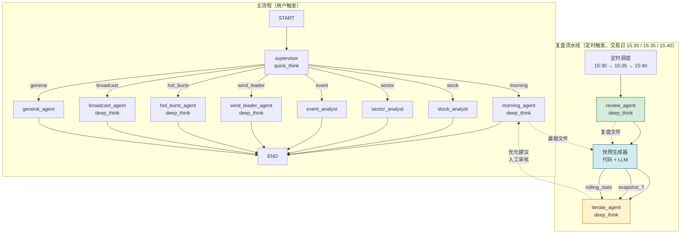

# AI Stock Agent Service

> LangGraph 多 Agent 智能体服务（Python），负责意图识别、Agent 编排和深度推理。
> Node.js 后端（aistock-app-api）作为数据层和 HTTP 接入层，Python 服务专注推理。

## 快速开始

```bash
# 创建虚拟环境
python -m venv .venv
source .venv/bin/activate  # Windows: .venv\Scripts\activate

# 安装依赖
pip install -e ".[dev]"

# 复制环境变量
cp .env.example .env
# 编辑 .env 填入实际配置

# 启动开发服务
uvicorn aistock_agent.main:app --reload --port 8000

# 运行测试
pytest tests/ -v

# 晨报定时测试（生成落盘到 docs/agent-outputs/morning/）
# Windows PowerShell
$env:PYTHONPATH = "src"; python scripts/run_morning_test.py

# 风口分析定时测试（生成落盘到 docs/agent-outputs/wind_leader/）
$env:PYTHONPATH = "src"; python scripts/run_wind_leader_test.py

# 播报生成测试（双人对话 + Node.js TTS 语音）
$env:PYTHONPATH = "src"; python scripts/run_broadcast_test.py

# 晨报缓存提取（从 Redis 提取到 docs/agent-outputs/morning/，不重新生成）
$env:PYTHONPATH = "src"; python scripts/extract_morning_cache.py
$env:PYTHONPATH = "src"; python scripts/extract_morning_cache.py --date 2026-07-09

# 代码检查
ruff check src/
mypy src/
```

## 技术栈

- 框架: FastAPI + uvicorn
- Agent 编排: LangGraph + LangChain
- LLM: langchain-openai（支持 DeepSeek/OpenAI）
- 缓存: Redis（会话持久化 + 晨报缓存）
- 境外数据: yfinance（美股/亚太/大宗/汇率）
- 全网搜索: Tavily
- 配置: pydantic-settings

## 架构

### 服务边界

```
┌─────────────────────────────────────────┐
│  Node.js Express API（数据层）           │
│  · A股数据Service（Tencent/Sina/THS）   │
│  · /api/agent/* → 反代到 Python 服务     │
│  · /internal/* → Python 专用数据接口     │
└──────────────┬──────────────────────────┘
               │ HTTP + SSE
┌──────────────▼──────────────────────────┐
│  Python FastAPI Agent 服务（推理层）     │
│  · LangGraph 图编排                      │
│  · 通过 /internal/* 回调 Node.js 拿数据  │
│  · yfinance：境外指数/大宗/汇率           │
│  · Tavily：全网财经新闻搜索              │
└─────────────────────────────────────────┘
```

**原则：Python 服务不拥有数据，只拥有推理。A 股实时数据留 Node.js。**

### Graph 拓扑



> 注：主流程 worker 为 morning / stock / sector / event + general 兜底，由 supervisor 路由；复盘流水线（review → snapshot → iterate）由定时调度触发，不经过 supervisor 路由。三个任务间隔 5 分钟顺序执行，通过文件 I/O 传递数据（晨报/复盘报告 → 快照 JSON → 迭代分析），非 LangGraph 图内边。

### 双模型策略

| 用途 | 模型 | 原因 |
|------|------|------|
| 意图分类/路由 | quick_think（gpt-4o-mini） | 低延迟，成本低 |
| 深度分析/晨报/事件/播报 | deep_think（gpt-4o） | 推理质量优先 |

### 播报Agent（核心特色）

播报Agent是AI Stock的核心特色功能，负责将多个Agent的分析结果汇总并生成双人对话播报：

- **输入**：晨报Agent + 风口Agent + 机构调研Agent的分析结果
  - scheduler 链路：从数据库 `agent_analysis_reports` 表读取（`report_date` 匹配当天），**优先读取 `podcast_brief`（150-200字播报摘要），降级读取 `display_report`（兼容旧数据，截取前500字）**
  - 实时请求：从 `state.analysis_reports` 读取（数据库未命中时降级）
- **输出**：双人对话文本 + Node.js 生成的语音播客（MP3格式）
- **模型**：deep_think（对话式播报生成）
- **语音引擎**：由 Node.js 封装火山引擎播客 API，Python 仅调用内部接口
- **发音人**：黑猫侦探社咪仔系列（男：`zh_male_dayixiansheng_v2_saturn_bigtts`，女：`zh_female_mizaitongxue_v2_saturn_bigtts`）
- **音频输出**：Node.js 写入 `AGENT_AUDIO_DIR`，并回写公开的 `audio_path`
- **双层输出消费**：通过 `utils/report_parser.py` 的 `extract_podcast_brief` / `extract_display_report` 函数读取双层结构内容，兼容 schema_version 1.0（单层 text）和 2.0（双层 display_report + podcast_brief）
- **测试**：`scripts\run_broadcast_test.bat` 或 `$env:PYTHONPATH = "src"; python scripts/run_broadcast_test.py`

### 智能投顾Agent（ai_advisor_agent）

智能投顾Agent负责回应用户的自然语言提问，优先从数据库读取已有分析报告整理汇总，降级使用工具获取数据：

- **触发条件**：`trigger_source="user"` 且 intent 不是 general/broadcast 时路由到 ai_advisor_agent
- **输入**：用户对话消息 + 数据库已有分析报告（morning/wind_leader/hot_burst 等）
- **报告读取**：通过 `utils/report_parser.py` 的 `extract_display_report` 读取展示文本（兼容 1.0 单层 text 和 2.0 双层 display_report）
- **降级策略**：DB 无报告时调用 advisor 工具集（get_quote、get_capital_flow、get_profit_forecast、search_cls_news、get_cls_news、get_global_markets、get_leader_stocks、get_hot_burst、get_hot_burst_history、tavily_finance_search）获取数据
- **输出**：简洁要点式回复（200字以内），直接展示在对话气泡中
- **模型**：deep_think
- **路由**：`intent="ai_advisor"` → `ai_advisor_agent`

### 报告双层输出（schema_version 2.0）

所有 Agent 持久化到数据库的 `content` 字段采用双层结构。

**为什么要做双层输出？（两个核心原因）**

1. **前端展示需要**：前端页面需要"概要 + 完整报告内容"两层数据。`display_report.summary` 用于列表页/卡片快速浏览，`display_report.details` 用于详情页完整展示。单层 text 无法支撑结构化展示。
2. **省 token（核心动机）**：双人播报语音生成费用较高，不能把完整长报告（500-1500字）喂给播报模型。`podcast_brief` 作为 broadcast_agent 和 ai_advisor_agent 的原材料，只输入 150-200 字的摘要，大幅降低 token 消耗。如果喂整个报告，token 成本会高数倍且播报模型容易跑偏。

双层结构定义如下：

```python
content = {
    "display_report": {
        "summary": "结论一句话（20字以内）",
        "details": "完整分析内容（500-1500字）",
        "stocks": ["股票代码"],   # 可选
        "risks": ["风险提示"]      # 可选
    },
    "podcast_brief": "150-200字的播报摘要，只含主题、事实、判断、风险",
    "schema_version": "2.0"
}
```

**消费方**：
- `broadcast_agent`：读取 `podcast_brief`（通过 `extract_podcast_brief`），汇总生成双人对话
- `ai_advisor_agent`：读取 `display_report`（通过 `extract_display_report`），整理成对话回复

**兼容性**：`utils/report_parser.py` 自动兼容 1.0 单层 `{"text": "..."}` 和 2.0 双层结构，旧报告无需迁移。

**LLM 输出要求**：Agent 提示词中须明确要求 LLM 在最终回复中输出 JSON 格式的双层内容。`parse_dual_layer_response` 函数会解析 JSON，解析失败时降级为单层（display_report.details = 原文本）。

**已改造 Agent**：wind_leader、broadcast、ai_advisor
**待改造 Agent**：morning、hot_burst、alert

### 机构调研热门股Agent

机构调研热门股Agent基于四信号源共振模型，自动检测机构调研热门股：

- **工具**：`get_hot_burst`（实时共振检测）、`get_hot_burst_history`（历史记录查询）
- **数据源**：Node.js `/internal/institution-research*` 接口
- **模型**：deep_think（ReAct 模式）
- **输出**：写入 `state.analysis_reports["hot_burst"]`，供播报Agent读取
- **路由**：intent=`hot_burst` → `hot_burst_agent`
- **降级文本**：`"机构调研热门股分析暂时不可用，请稍后重试"`

### 定时调度

`services/scheduler.py` 基于 APScheduler `AsyncIOScheduler` 集成，交易日自动执行（非交易日通过 `utils/date.is_trading_day()` 自动跳过）。调度器在 `main.py` lifespan 中启动/关闭，与 RedisPool / HttpClientPool 同生命周期。

| 时间 | 任务 | job_id | 说明 |
|------|------|--------|------|
| 08:50 | 晨报生成 | `morning_briefing` | 双层输出（display_report + podcast_brief + schema_version）；写 Redis 缓存（JSON）+ 落盘到 `docs/agent-outputs/morning/` + 持久化到 Node.js `/internal/analysis-reports`（公共报告 user_id=null）；完成后自动并行触发 event agent 分析 major_events（fire-and-forget） |
| 09:00 | 播报链路 | `broadcast_chain` | 串行执行 morning→wind_leader→hot_burst→broadcast，报告写DB + 双人语音播报（9:10前端可见） |
| 15:30 | 复盘生成 | `review_report` | 收盘后 5 步归因分析，写 Redis 缓存 + 归档到 `docs/agent-outputs/review/` + 写数据库 |
| 15:35 | 快照生成 | `snapshot_build` | 晨报 × 复盘 4 维度偏差评估，归档到 `docs/agent-outputs/snapshots/` |
| 15:40 | 迭代分析 | `iterate_analysis` | 阈值判断 + 偏差分析报告 + 优化建议，归档到 `docs/agent-outputs/iterate/` |

> **事件传导分析（event conduction）**：不单独注册 cron job，而是嵌入 morning 任务中——晨报完成后提取 `major_events`，对 impact_score ≥ 4 的事件通过 `asyncio.create_task` 并行触发 `event_agent.run()`。每个事件独立运行，fire-and-forget 模式，失败不影响其他事件或后续复盘流水线。

复盘流水线（review → snapshot → iterate）三个任务间隔 5 分钟顺序执行，通过文件 I/O 传递数据：复盘 agent 生成复盘报告文件 → 快照生成器读取晨报 + 复盘文件生成快照 JSON → 迭代 agent 读取快照 + rolling_stats 判断阈值。每个任务独立 try/except，前一步失败不阻塞后一步（后一步检测到文件缺失会降级）。开发/测试环境可设 `SCHEDULER_ENABLED=false` 关闭调度。

### 目录结构

> Phase 4 物理分层 + Phase 5 基础设施增强后的结构（2026-07-08）。

```
src/aistock_agent/
├── main.py              # FastAPI 入口（lifespan 管理 RedisPool + HttpClientPool + Scheduler）
├── config.py            # pydantic-settings 配置（多模型/连接池/LangSmith/CORS/调度）
├── constants.py         # SSE 事件类型 / intent 集合 / 错误码 / TOOL_LABELS
├── data/                # 静态数据文件
│   └── sector_aliases.json  # 板块别名字典（35 标准板块 → 别名列表，快照生成器第一级匹配用）
├── state/
│   └── schema.py        # AgentState TypedDict
├── schemas/             # 数据模型（Pydantic 对外交互 + TypedDict 内部结构）
│   ├── chat.py          # ChatRequest / ChatResponse
│   ├── sse.py           # SSEEvent
│   ├── agents.py        # 各 Agent 输入/输出 schema
│   └── snapshot.py      # 快照数据模型（11 TypedDict：SnapshotData / RollingStatsData / ManifestData 等）
├── memory/              # 持久化记忆模块（Phase 4）
│   ├── checkpointer.py  # LangGraph checkpointer 工厂（MemorySaver 默认）
│   ├── session_store.py # 会话历史读写
│   └── preferences.py   # 用户偏好/自选股记忆
├── utils/               # 通用工具（Phase 4）
│   ├── sse.py           # LangGraph 事件 → SSE 事件映射（支持 filter_type 双流分流）
│   ├── parser.py        # LLM 输出解析（parse_intent）
│   ├── message.py       # 消息提取工具
│   ├── report_parser.py # 双层报告解析（兼容 schema_version 1.0/2.0，extract_podcast_brief/extract_display_report/parse_dual_layer_response）
│   ├── output_parser.py # _parse_json + transform_to_frontend（事件 Agent v3 前端对齐）+ extract_major_events
│   └── date.py          # 日期/交易日工具
├── errors/              # 异常体系（Phase 4）
│   └── exceptions.py    # AgentError / DataUnavailableError / LLMTimeoutError / ToolExecutionError / RouteError
├── graph/
│   ├── builder.py       # StateGraph 构建 + compile()（哨兵模式挂载 checkpointer）
│   └── routers/
│       └── intent_router.py  # route_by_intent（从 edges.py 迁入）
├── agents/              # 物理分层：supervisor/ + general/ + workers/（Phase 4）
│   ├── supervisor/
│   │   └── node.py      # 意图分类（quick_think）
│   ├── general/
│   │   └── node.py      # 兜底对话（quick_think）
│   └── workers/
│       ├── morning.py   # 晨报（ReAct + 双层输出 + Redis 缓存 + 持久化 + 文件归档）
│       ├── stock.py     # 个股分析
│       ├── sector.py    # 板块分析
│       ├── event.py     # 事件传导链（v3：Redis 缓存 + 双层输出解析 + 完整 analysis_reports 持久化 + event_id 隔离）
│       ├── hot_burst.py # 机构调研热门股（ReAct + 写入 analysis_reports）
│       ├── wind_leader.py # 长线风口龙头（定时触发 + 文件归档 + 双层输出）
│       ├── broadcast.py # 播报生成（deep_think + Node.js 双人播客 + 消费 podcast_brief）
│       ├── ai_advisor.py # 智能投顾（消费 display_report，对话气泡展示）
│       ├── alert.py     # 异动提醒（deep_think + 三步框架 + cycle 短中长线分类）
│       ├── review.py    # 复盘归因（ReAct + Redis 缓存 + 文件归档，scheduler 触发）
│       └── iterate.py   # 迭代分析（非 ReAct，pipeline + LLM，只读，scheduler 触发）
├── tools/
│   ├── base.py               # safe_tool_call 装饰器 + BaseToolMixin + DEGRADED_MESSAGE
│   ├── registry.py           # 工具注册中心：get_tools(category) / get_all_tools()（新增）
│   ├── stock_tools.py        # get_quote, get_capital_flow, get_profit_forecast
│   ├── sector_tools.py       # get_leader_stocks, get_wind_leaders
│   ├── news_tools.py         # search_cls_news, get_news_fulltext, get_cls_news
│   ├── market_tools.py       # get_global_markets（yfinance 境外行情，回归纯 yfinance）
│   ├── search_tools.py       # tavily_finance_search（Tavily 全网搜索，从 market_tools 拆出）
│   ├── monitor_tools.py      # get_stock_monitor, get_alert_history（Phase 5）
│   ├── tenx_tools.py         # get_tenx_score, get_tenx_top_stocks（Phase 5）
│   ├── graph_tools.py        # get_concepts, get_graph_by_concept（Phase 5）
│   ├── industry_vector_search.py  # match_industry_by_keywords（pgvector 语义匹配，event 工具集）
│   ├── hot_burst_tools.py    # get_hot_burst, get_hot_burst_history（Phase 5）
│   └── review_tools.py       # get_market_summary, get_sector_performance（复盘流水线，review category）
├── prompts/             # 分层对应 agents 目录（Phase 4）
│   ├── supervisor/routing.py
│   ├── general/system.py
│   └── workers/{morning,stock,sector,event,hot_burst,wind_leader,broadcast,ai_advisor,alert,review,iterate}.py
├── services/
│   ├── data_client.py   # httpx → Node.js /internal/* API（get / get_list / post）
│   ├── redis_pool.py    # Redis 连接池单例（lifespan 管理）
│   ├── http_client.py   # httpx AsyncClient 连接池单例（lifespan 管理）
│   ├── cache.py         # 晨报缓存服务（基于 RedisPool，存储双层 JSON）
│   ├── morning_persister.py  # 晨报持久化服务（→ Node.js /internal/analysis-reports，公共报告）
│   ├── event_persister.py    # 事件持久化服务（→ Node.js /internal/analysis-reports，event_id 隔离 + 完整 analysis_reports）
│   ├── llm.py           # 双模型工厂（quick_think / deep_think + 可观测性回调）
│   ├── tavily.py        # Tavily 客户端封装层（Key 轮换，供 search_tools 调用）
│   ├── snapshot_builder.py  # 快照生成器 service（复盘流水线，文件I/O+MA+manifest+板块匹配+LLM 4维评估+语义匹配）
│   ├── data_guard.py    # 空数据预检（ensure_data_available + DataCheck，规范13，scheduler触发时预检Node.js数据源）
│   └── scheduler.py     # APScheduler 定时调度（lifespan 管理，交易日 08:50/09:00/15:30/15:35/15:40）
├── observability/       # 可观测性包（Phase 5）
│   ├── logging.py       # structlog JSON 日志配置（setup_logging / get_logger）
│   ├── metrics.py       # MetricsCollector 线程安全计数器（token/call/error）
│   └── callback.py      # LangChain 回调（TokenUsage / AgentTrace，零侵入业务逻辑）
└── api/
    ├── routes.py        # REST 接口 + 健康检查（/health、/health/ready）
    ├── deps.py          # 依赖注入（verify_internal_token / build_initial_state）
    ├── ws.py            # WebSocket 流式接口
    └── middleware.py    # HTTP 中间件（request_id 注入、访问日志、CORS）（Phase 5）
```

### 输出归档

- 晨报 Agent 的 `run()` 在生成后**自动归档**到 `docs/agent-outputs/morning/YYYY-MM-DD-HHMM-briefing.md`（归档内容为双层报告 `display_report.details` 的 Markdown 文本，供 snapshot_builder 读取）
- 晨报输出为双层结构：`display_report`（summary/details/stocks/risks）+ `podcast_brief`（150～200字播报摘要）+ `schema_version`；Redis 缓存存储完整双层 JSON，读取侧兼容旧 schema 1.0 纯文本
- 晨报同时持久化到 Node.js `/internal/analysis-reports`（公共报告，`report_type=morning`、`user_id=null`，前端公开接口可读取）
- 使用 `python scripts/run_morning_test.py` 可直接生成并落盘，文件头包含生成时间、耗时、交易日、缓存命中等元数据
- 晨报 Redis 缓存提取归档到 `docs/agent-outputs/morning/YYYY-MM-DD-briefing.md`
- 使用 `python scripts/extract_morning_cache.py` 从 Redis 缓存提取已生成的晨报（不触发 LLM 重新生成），支持 `--date YYYY-MM-DD` 指定日期，默认提取所有缓存报告
- 复盘报告归档到 `docs/agent-outputs/review/YYYY-MM-DD-HHMM-review.md`（scheduler 15:30 触发，自动归档）
- 播客音频由 Node.js 写入 `AGENT_AUDIO_DIR`，报告仅保存公开的 `audio_path`
- 快照 JSON 归档到 `docs/agent-outputs/snapshots/YYYY-MM-DD.json`（scheduler 15:35 触发，含 4 维度偏差评估）
- 迭代分析报告归档到 `docs/agent-outputs/iterate/YYYY-MM-DD.json`（scheduler 15:40 触发，JSON 格式）
- 滚动统计归档到 `docs/agent-outputs/rolling_stats.json`（快照生成器维护，MA5/MA10/MA20）
- 历史记录清单归档到 `docs/agent-outputs/manifest.json`（快照生成器维护，每日追加一条记录）

## API 接口

| 方法 | 路径 | 说明 |
|------|------|------|
| POST | `/api/agent/chat/message` | 对话消息（非流式，@deprecated） |
| POST | `/api/agent/chat/stream/messages` | 对话文本流（SSE，LLM 文本 + DONE） |
| POST | `/api/agent/chat/stream/updates` | 对话工具流（SSE，AGENT_SWITCH + TOOL 事件 + DONE） |
| GET | `/api/agent/briefing/morning` | 晨报（SSE 流式，graph 转发，支持 Redis 缓存） |
| GET | `/api/agent/briefing/alert` | 异动提醒（SSE 流式，symbol + cycle 参数） |
| GET | `/api/agent/skills` | 已注册工具列表 |
| GET | `/health` | Liveness 健康检查（始终 200，不检查依赖，K8s livenessProbe 用） |
| GET | `/health/ready` | Readiness 健康检查（检查 Redis/Node.js/LLM 连通性，失败返回 503 + degraded） |

Node.js 侧将 `/api/agent/*` 的请求反代到 Python 服务对应路径。

### Node.js 配合接口

Python 服务通过以下接口获取 A 股数据（需携带 `X-Internal-Token`）：

| 接口 | 数据源 | 说明 |
|------|--------|------|
| `GET /internal/quote/:symbol` | 腾讯行情 | 个股实时行情 |
| `GET /internal/flow/:symbol` | 新浪+Tushare | 资金流向 |
| `GET /internal/leader/:tagCode` | Tushare | 板块龙头 |
| `GET /internal/news/search/:symbol` | 财联社 | 个股新闻 |
| `GET /internal/news/latest` | 财联社 | 最新快讯（晨报用） |
| `GET /internal/news/fulltext/:id` | 财联社 | 新闻全文 |
| `GET /internal/forecast/:symbol` | 同花顺 | 盈利预测 |
| `GET /internal/wind-leaders` | 风口算法 | 风口龙头数据（Phase 5） |
| `GET /internal/monitor/:symbol` | 异动引擎 | 个股异动数据（Phase 5） |
| `GET /internal/monitor/alerts` | 异动引擎 | 预警历史（Phase 5） |
| `GET /internal/tenx/score/:symbol` | 十倍股评分 | 评分详情（Phase 5） |
| `GET /internal/tenx/top` | 十倍股评分 | 排行列表（Phase 5） |
| `GET /internal/graph/concepts` | 知识图谱 | 产业链概念列表（Phase 5） |
| `GET /internal/graph/:concept` | 知识图谱 | 产业链图谱数据（Phase 5） |
| `GET /internal/institution-research` | 机构调研 | 共振检测结果（Phase 5） |
| `GET /internal/institution-research/history` | 机构调研 | 历史记录（Phase 5） |
| `POST /internal/briefing/generate-audio` | 火山引擎/Azure TTS | 根据 broadcast 报告生成音频并写回 audio_path |
| `GET /internal/health` | - | 轻量健康探针（供 Python `/health/ready` 探测，Phase 5） |

## 开发规范

### State-first 原则
- 所有数据通过 AgentState 流转，禁止节点间隐式传递
- 新增状态字段必须修改 `state/schema.py`

### 新增 Tool 流程
1. 在 `tools/` 对应文件中定义 `@tool` + `@safe_tool_call` 装饰的 async 函数
2. 参数必须定义类型注解和 docstring（供 LLM 理解工具用途）
3. 通过 `services/data_client.py` 的 `NodeApiClient` 调用 Node.js `/internal/*` 接口
4. 在定义该 tool 的文件底部调用 `register("category", tool)` 自注册（无需编辑 registry.py）
5. 默认 `expose=True`，自动出现在 `GET /api/agent/skills`；如需隐藏，加 `expose=False`
6. 必须编写 mock 测试（正常 + 异常降级，`tests/unit/` 目录）

### 新增 Agent 流程
1. 在 `agents/workers/` 新增文件，实现 `async def run(state: AgentState) -> dict`
2. 在 `graph/builder.py` 注册节点
3. 在 `graph/routers/intent_router.py` 添加路由条件（如果需要新 intent）
4. 在该 agent 使用的 tool 文件底部调用 `register("category", tool)` 注册到对应 category（如已有工具复用现有 category，无需新增）
5. agent 内通过 `from aistock_agent.tools.registry import get_tools` + `get_tools("<category>")` 获取工具集，禁止手动 import + 拼接工具列表
6. 在 `services/llm.py` 绑定对应的工具集（quick_think / deep_think）

> **例外：定时触发型 Agent**：review / iterate agent 不经过 supervisor 路由，不注册到 `graph/builder.py`，而是由 `services/scheduler.py` 的 `_run_review_task` / `_run_iterate_task` 直接调用 `agent.run(state)`。详见 `AGENT_STANDARDS.md` 规范 3。

### 提示词管理
- 统一存放 `prompts/` 目录
- 日期等动态内容用占位符（如 `{{DATE}}`），运行时替换
- 不在代码中硬编码长提示词

### 错误处理
- Tool 失败时返回降级文本（如"数据暂不可用"），不抛异常中断图执行
- Agent 节点必须 try-catch 包裹

### 缓存规范
- 晨报结果缓存 Redis TTL=2小时，存储双层 JSON（display_report + podcast_brief + schema_version）
- 缓存 key 格式：`briefing:morning:YYYY-MM-DD`
- 读取侧兼容旧纯文本缓存（schema_version="1.0" 自动包装为双层）

### 可观测性
- 日志：`observability.logging.setup_logging()` 在应用启动前配置 structlog JSON 输出（timestamp/level/event，支持 contextvars request_id）
- 指标：`MetricsCollector` 线程安全计数器，通过 `get_metrics()` 获取 token 用量、调用次数、错误率
- 回调：`TokenUsageCallback` / `AgentTraceCallback` 挂载在 ChatOpenAI 实例上（LLM 级，on_llm_*），自动统计 token 和追踪 agent 步骤；`compile_graph()` 默认自动挂载同名回调到图级（on_chain_*），无需调用方显式传入
- LangSmith：`LANGSMITH_ENABLED=true` 时自动启用 LangChain 追踪（默认关闭，仅调试用）
- **硬约束**：可观测性通过 callback/middleware 解耦，agent 节点和工具函数零侵入（禁止在业务逻辑中直接调用 structlog）

### 关键约束
- 禁止在 Python 重复实现 A 股数据获取逻辑
- LLM 调用失败时返回降级文本，不重试
- yfinance 仅用于境外市场数据（美股/亚太/大宗/汇率）
- 晨报 Agent 必须通过 Redis 缓存，同一天不重复调用 deep_think

## 环境变量

| 变量 | 说明 | 默认值 |
|------|------|--------|
| `NODE_API_BASE_URL` | Node.js 后端地址 | `http://localhost:3000` |
| `OPENAI_API_KEY` | OpenAI API 密钥 | - |
| `OPENAI_BASE_URL` | OpenAI API 基础 URL | `https://api.openai.com/v1` |
| `QUICK_THINK_MODEL` | 快速模型名称 | `gpt-4o-mini` |
| `DEEP_THINK_MODEL` | 深度模型名称 | `gpt-4o` |
| `QUICK_THINK_TEMPERATURE` | 快速模型 temperature | `0.1` |
| `QUICK_THINK_MAX_TOKENS` | 快速模型 max_tokens | `2000` |
| `DEEP_THINK_TEMPERATURE` | 深度模型 temperature | `0.3` |
| `DEEP_THINK_MAX_TOKENS` | 深度模型 max_tokens | `4000` |
| `REDIS_URL` | Redis 连接地址 | `redis://localhost:6379/1` |
| `REDIS_MAX_CONNECTIONS` | Redis 连接池最大连接数 | `10` |
| `HTTP_TIMEOUT_SECONDS` | httpx 请求超时（秒） | `10.0` |
| `TAVILY_API_KEY` | Tavily 搜索 API 密钥 | - |
| `INTERNAL_API_TOKEN` | 内网鉴权 Token | `change-me-in-production` |
| `CORS_ORIGINS` | CORS 允许的源列表（逗号分隔或 JSON 数组） | `*` |
| `HEALTH_CHECK_LLM` | `/health/ready` 是否探测 LLM 连通性（默认跳过避免消耗 token） | `false` |
| `LOG_LEVEL` | structlog 日志级别（DEBUG/INFO/WARNING/ERROR） | `INFO` |
| `LANGSMITH_ENABLED` | LangSmith 追踪开关 | `false` |
| `LANGSMITH_API_KEY` | LangSmith API 密钥 | - |
| `LANGSMITH_PROJECT` | LangSmith 项目名 | `aistock-agent` |
| `SCHEDULER_ENABLED` | 定时调度开关（关闭后 lifespan 不启动调度器） | `true` |
| `SCHEDULER_TIMEZONE` | 调度时区 | `Asia/Shanghai` |
| `SCHEDULER_MORNING_CRON` | 晨报生成 cron（工作日 08:50） | `50 8 * * 1-5` |
| `SCHEDULER_REVIEW_CRON` | 复盘生成 cron（工作日 15:30） | `30 15 * * 1-5` |
| `SCHEDULER_SNAPSHOT_CRON` | 快照生成 cron（工作日 15:35） | `35 15 * * 1-5` |
| `SCHEDULER_ITERATE_CRON` | 迭代分析 cron（工作日 15:40） | `40 15 * * 1-5` |

## Vibecoding 工作流

本项目使用 aistock-workflow rules 规范 AI 辅助开发流程。在 Trae IDE 中开发时，AI 自动执行 9 步流程：上下文加载→需求确认→编码→跨端同步检查→验证→文档维护→用户验收→技能缺口记录→修改记录。

详见：[Vibecoding 工作流文档](../docs/vibecoding-workflow.md)

## 部署

```bash
# Docker 构建
docker build -t aistock-agent .

# 运行
docker run -p 8000:8000 --env-file .env aistock-agent
```

## 相关项目

- [aistock-app-api](../aistock-app-api) — Node.js 后端（数据层 + HTTP 接入）
- [aistock-app-frontend](../aistock-app-frontend) — App 前端
