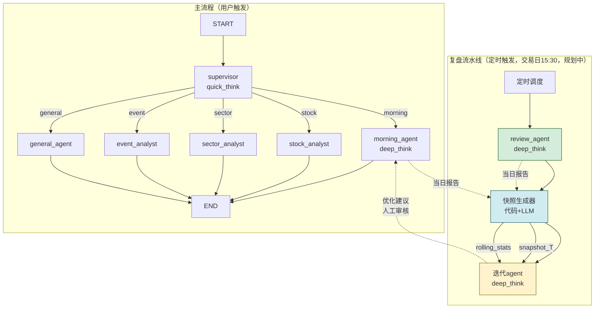

# AI Stock Agent Service

> LangGraph 多 Agent 智能体服务（Python），负责意图识别、Agent 编排和深度推理。
> Node.js 后端（aistock-app-api）作为数据层和 HTTP 接入层，Python 服务专注推理。

## 快速开始

```bash
# 创建虚拟环境
python -m venv .venv
source .venv/bin/activate  # Windows: .venv\Scripts\activate

# 安装依赖
pip install -e ".[dev]"

# 复制环境变量
cp .env.example .env
# 编辑 .env 填入实际配置

# 启动开发服务
uvicorn aistock_agent.main:app --reload --port 8000

# 运行测试
pytest tests/ -v

# 晨报定时测试（生成落盘到 docs/agent-outputs/morning/）
# Windows PowerShell
$env:PYTHONPATH = "src"; python scripts/run_morning_test.py

# 代码检查
ruff check src/
mypy src/
```

## 技术栈

- 框架: FastAPI + uvicorn
- Agent 编排: LangGraph + LangChain
- LLM: langchain-openai（支持 DeepSeek/OpenAI）
- 缓存: Redis（会话持久化 + 晨报缓存）
- 境外数据: yfinance（美股/亚太/大宗/汇率）
- 全网搜索: Tavily
- 配置: pydantic-settings

## 架构

### 服务边界

```
┌─────────────────────────────────────────┐
│  Node.js Express API（数据层）           │
│  · A股数据Service（Tencent/Sina/THS）   │
│  · /api/agent/* → 反代到 Python 服务     │
│  · /internal/* → Python 专用数据接口     │
└──────────────┬──────────────────────────┘
               │ HTTP + SSE
┌──────────────▼──────────────────────────┐
│  Python FastAPI Agent 服务（推理层）     │
│  · LangGraph 图编排                      │
│  · 通过 /internal/* 回调 Node.js 拿数据  │
│  · yfinance：境外指数/大宗/汇率           │
│  · Tavily：全网财经新闻搜索              │
└─────────────────────────────────────────┘
```

**原则：Python 服务不拥有数据，只拥有推理。A 股实时数据留 Node.js。**

### Graph 拓扑



> 注：主流程已实现的 worker 为 morning / stock / sector / event + general 兜底；复盘流水线（review / snapshot / iterate）为规划中，由定时调度触发，不经过 supervisor 路由。

### 双模型策略

| 用途 | 模型 | 原因 |
|------|------|------|
| 意图分类/路由 | quick_think（gpt-4o-mini） | 低延迟，成本低 |
| 深度分析/晨报/事件 | deep_think（gpt-4o） | 推理质量优先 |

### 定时调度

`services/scheduler.py` 基于 APScheduler `AsyncIOScheduler` 集成，交易日自动执行（非交易日通过 `utils/date.is_trading_day()` 自动跳过）。调度器在 `main.py` lifespan 中启动/关闭，与 RedisPool / HttpClientPool 同生命周期。

| 时间 | 任务 | job_id | 说明 |
|------|------|--------|------|
| 08:50 | 晨报生成 | `morning_briefing` | 写 Redis 缓存，用户打开 App 命中缓存 |
| 15:30 | 复盘生成 | `review_report` | 收盘后归因分析（规划中） |
| 15:35 | 快照生成 | `snapshot_build` | 晨报 vs 复盘偏差评估（规划中） |
| 15:40 | 迭代分析 | `iterate_analysis` | 偏差分析报告 + 优化建议（规划中） |

> 注：review / snapshot / iterate 三个任务已注册 job 并完成交易日过滤，但具体执行逻辑待对应 agent / 快照生成器实现后接入。开发/测试环境可设 `SCHEDULER_ENABLED=false` 关闭调度。

### 目录结构

> Phase 4 物理分层 + Phase 5 基础设施增强后的结构（2026-07-08）。

```
src/aistock_agent/
├── main.py              # FastAPI 入口（lifespan 管理 RedisPool + HttpClientPool + Scheduler）
├── config.py            # pydantic-settings 配置（多模型/连接池/LangSmith/CORS/调度）
├── constants.py         # SSE 事件类型 / intent 集合 / 错误码 / TOOL_LABELS
├── state/
│   └── schema.py        # AgentState TypedDict
├── schemas/             # 对外交互 Pydantic 数据模型
│   ├── chat.py          # ChatRequest / ChatResponse
│   ├── sse.py           # SSEEvent
│   └── agents.py        # 各 Agent 输入/输出 schema
├── memory/              # 持久化记忆模块（Phase 4）
│   ├── checkpointer.py  # LangGraph checkpointer 工厂（MemorySaver 默认）
│   ├── session_store.py # 会话历史读写
│   └── preferences.py   # 用户偏好/自选股记忆
├── utils/               # 通用工具（Phase 4）
│   ├── sse.py           # LangGraph 事件 → SSE 事件映射
│   ├── parser.py        # LLM 输出解析（parse_intent）
│   ├── message.py       # 消息提取工具
│   └── date.py          # 日期/交易日工具
├── errors/              # 异常体系（Phase 4）
│   └── exceptions.py    # AgentError / DataUnavailableError / LLMTimeoutError / ToolExecutionError / RouteError
├── graph/
│   ├── builder.py       # StateGraph 构建 + compile()（哨兵模式挂载 checkpointer）
│   └── routers/
│       └── intent_router.py  # route_by_intent（从 edges.py 迁入）
├── agents/              # 物理分层：supervisor/ + general/ + workers/（Phase 4）
│   ├── supervisor/
│   │   └── node.py      # 意图分类（quick_think）
│   ├── general/
│   │   └── node.py      # 兜底对话（quick_think）
│   └── workers/
│       ├── morning.py   # 晨报（ReAct + Redis 缓存）
│       ├── stock.py     # 个股分析
│       ├── sector.py    # 板块分析
│       └── event.py     # 事件传导链
├── tools/
│   ├── base.py               # safe_tool_call 装饰器 + BaseToolMixin + DEGRADED_MESSAGE
│   ├── registry.py           # 工具注册中心：get_tools(category) / get_all_tools()（新增）
│   ├── stock_tools.py        # get_quote, get_capital_flow, get_profit_forecast
│   ├── sector_tools.py       # get_leader_stocks, get_wind_leaders
│   ├── news_tools.py         # search_cls_news, get_news_fulltext, get_cls_news
│   ├── market_tools.py       # get_global_markets（yfinance 境外行情，回归纯 yfinance）
│   ├── search_tools.py       # tavily_finance_search（Tavily 全网搜索，从 market_tools 拆出）
│   ├── monitor_tools.py      # get_stock_monitor, get_alert_history（Phase 5）
│   ├── tenx_tools.py         # get_tenx_score, get_tenx_top_stocks（Phase 5）
│   ├── graph_tools.py        # get_concepts, get_graph_by_concept（Phase 5）
│   └── hot_burst_tools.py    # get_hot_burst, get_hot_burst_history（Phase 5）
├── prompts/             # 分层对应 agents 目录（Phase 4）
│   ├── supervisor/routing.py
│   ├── general/system.py
│   └── workers/{morning,stock,sector,event}.py
├── services/
│   ├── data_client.py   # httpx → Node.js /internal/* API（get / get_list）
│   ├── redis_pool.py    # Redis 连接池单例（lifespan 管理）
│   ├── http_client.py   # httpx AsyncClient 连接池单例（lifespan 管理）
│   ├── cache.py         # 晨报缓存服务（基于 RedisPool）
│   ├── llm.py           # 双模型工厂（quick_think / deep_think + 可观测性回调）
│   ├── tavily.py        # Tavily 客户端封装层（Key 轮换，供 search_tools 调用）
│   └── scheduler.py     # APScheduler 定时调度（lifespan 管理，交易日 08:50/15:30/15:35/15:40）
├── observability/       # 可观测性包（Phase 5）
│   ├── logging.py       # structlog JSON 日志配置（setup_logging / get_logger）
│   ├── metrics.py       # MetricsCollector 线程安全计数器（token/call/error）
│   └── callback.py      # LangChain 回调（TokenUsage / AgentTrace，零侵入业务逻辑）
└── api/
    ├── routes.py        # REST 接口 + 健康检查（/health、/health/ready）
    ├── deps.py          # 依赖注入（verify_internal_token / build_initial_state）
    ├── ws.py            # WebSocket 流式接口
    └── middleware.py    # HTTP 中间件（request_id 注入、访问日志、CORS）（Phase 5）
```

### 输出归档

- 晨报 Agent 的测试输出默认归档到 `docs/agent-outputs/morning/YYYY-MM-DD-HHMM-briefing.md`
- 使用 `python scripts/run_morning_test.py` 可直接生成并落盘，文件头包含生成时间、耗时、交易日、缓存命中等元数据

## API 接口

| 方法 | 路径 | 说明 |
|------|------|------|
| POST | `/api/agent/chat/message` | 对话消息（非流式） |
| GET | `/api/agent/briefing/morning` | 晨报（SSE 流式，支持 Redis 缓存） |
| GET | `/api/agent/skills` | 已注册工具列表 |
| GET | `/health` | Liveness 健康检查（始终 200，不检查依赖，K8s livenessProbe 用） |
| GET | `/health/ready` | Readiness 健康检查（检查 Redis/Node.js/LLM 连通性，失败返回 503 + degraded） |

Node.js 侧将 `/api/agent/*` 的请求反代到 Python 服务对应路径。

### Node.js 配合接口

Python 服务通过以下接口获取 A 股数据（需携带 `X-Internal-Token`）：

| 接口 | 数据源 | 说明 |
|------|--------|------|
| `GET /internal/quote/:symbol` | 腾讯行情 | 个股实时行情 |
| `GET /internal/flow/:symbol` | 新浪+Tushare | 资金流向 |
| `GET /internal/leader/:tagCode` | Tushare | 板块龙头 |
| `GET /internal/news/search/:symbol` | 财联社 | 个股新闻 |
| `GET /internal/news/latest` | 财联社 | 最新快讯（晨报用） |
| `GET /internal/news/fulltext/:id` | 财联社 | 新闻全文 |
| `GET /internal/forecast/:symbol` | 同花顺 | 盈利预测 |
| `GET /internal/wind-leaders` | 风口算法 | 风口龙头数据（Phase 5） |
| `GET /internal/monitor/:symbol` | 异动引擎 | 个股异动数据（Phase 5） |
| `GET /internal/monitor/alerts` | 异动引擎 | 预警历史（Phase 5） |
| `GET /internal/tenx/score/:symbol` | 十倍股评分 | 评分详情（Phase 5） |
| `GET /internal/tenx/top` | 十倍股评分 | 排行列表（Phase 5） |
| `GET /internal/graph/concepts` | 知识图谱 | 产业链概念列表（Phase 5） |
| `GET /internal/graph/:concept` | 知识图谱 | 产业链图谱数据（Phase 5） |
| `GET /internal/institution-research` | 机构调研 | 共振检测结果（Phase 5） |
| `GET /internal/institution-research/history` | 机构调研 | 历史记录（Phase 5） |
| `GET /internal/health` | - | 轻量健康探针（供 Python `/health/ready` 探测，Phase 5） |

## 开发规范

### State-first 原则
- 所有数据通过 AgentState 流转，禁止节点间隐式传递
- 新增状态字段必须修改 `state/schema.py`

### 新增 Tool 流程
1. 在 `tools/` 对应文件中定义 `@tool` + `@safe_tool_call` 装饰的 async 函数
2. 参数必须定义类型注解和 docstring（供 LLM 理解工具用途）
3. 通过 `services/data_client.py` 的 `NodeApiClient` 调用 Node.js `/internal/*` 接口
4. 在定义该 tool 的文件底部调用 `register("category", tool)` 自注册（无需编辑 registry.py）
5. 默认 `expose=True`，自动出现在 `GET /api/agent/skills`；如需隐藏，加 `expose=False`
6. 必须编写 mock 测试（正常 + 异常降级，`tests/unit/` 目录）

### 新增 Agent 流程
1. 在 `agents/workers/` 新增文件，实现 `async def run(state: AgentState) -> dict`
2. 在 `graph/builder.py` 注册节点
3. 在 `graph/routers/intent_router.py` 添加路由条件（如果需要新 intent）
4. 在该 agent 使用的 tool 文件底部调用 `register("category", tool)` 注册到对应 category（如已有工具复用现有 category，无需新增）
5. agent 内通过 `from aistock_agent.tools.registry import get_tools` + `get_tools("<category>")` 获取工具集，禁止手动 import + 拼接工具列表
6. 在 `services/llm.py` 绑定对应的工具集（quick_think / deep_think）

### 提示词管理
- 统一存放 `prompts/` 目录
- 日期等动态内容用占位符（如 `{{DATE}}`），运行时替换
- 不在代码中硬编码长提示词

### 错误处理
- Tool 失败时返回降级文本（如"数据暂不可用"），不抛异常中断图执行
- Agent 节点必须 try-catch 包裹

### 缓存规范
- 晨报结果缓存 Redis TTL=2小时
- 缓存 key 格式：`briefing:morning:YYYY-MM-DD`

### 可观测性
- 日志：`observability.logging.setup_logging()` 在应用启动前配置 structlog JSON 输出（timestamp/level/event，支持 contextvars request_id）
- 指标：`MetricsCollector` 线程安全计数器，通过 `get_metrics()` 获取 token 用量、调用次数、错误率
- 回调：`TokenUsageCallback` / `AgentTraceCallback` 挂载在 ChatOpenAI 实例上（LLM 级，on_llm_*），自动统计 token 和追踪 agent 步骤；`compile_graph()` 默认自动挂载同名回调到图级（on_chain_*），无需调用方显式传入
- LangSmith：`LANGSMITH_ENABLED=true` 时自动启用 LangChain 追踪（默认关闭，仅调试用）
- **硬约束**：可观测性通过 callback/middleware 解耦，agent 节点和工具函数零侵入（禁止在业务逻辑中直接调用 structlog）

### 关键约束
- 禁止在 Python 重复实现 A 股数据获取逻辑
- LLM 调用失败时返回降级文本，不重试
- yfinance 仅用于境外市场数据（美股/亚太/大宗/汇率）
- 晨报 Agent 必须通过 Redis 缓存，同一天不重复调用 deep_think

## 环境变量

| 变量 | 说明 | 默认值 |
|------|------|--------|
| `NODE_API_BASE_URL` | Node.js 后端地址 | `http://localhost:3000` |
| `OPENAI_API_KEY` | OpenAI API 密钥 | - |
| `OPENAI_BASE_URL` | OpenAI API 基础 URL | `https://api.openai.com/v1` |
| `QUICK_THINK_MODEL` | 快速模型名称 | `gpt-4o-mini` |
| `DEEP_THINK_MODEL` | 深度模型名称 | `gpt-4o` |
| `QUICK_THINK_TEMPERATURE` | 快速模型 temperature | `0.1` |
| `QUICK_THINK_MAX_TOKENS` | 快速模型 max_tokens | `2000` |
| `DEEP_THINK_TEMPERATURE` | 深度模型 temperature | `0.3` |
| `DEEP_THINK_MAX_TOKENS` | 深度模型 max_tokens | `4000` |
| `REDIS_URL` | Redis 连接地址 | `redis://localhost:6379/1` |
| `REDIS_MAX_CONNECTIONS` | Redis 连接池最大连接数 | `10` |
| `HTTP_TIMEOUT_SECONDS` | httpx 请求超时（秒） | `10.0` |
| `TAVILY_API_KEY` | Tavily 搜索 API 密钥 | - |
| `INTERNAL_API_TOKEN` | 内网鉴权 Token | `change-me-in-production` |
| `CORS_ORIGINS` | CORS 允许的源列表（逗号分隔或 JSON 数组） | `*` |
| `HEALTH_CHECK_LLM` | `/health/ready` 是否探测 LLM 连通性（默认跳过避免消耗 token） | `false` |
| `LOG_LEVEL` | structlog 日志级别（DEBUG/INFO/WARNING/ERROR） | `INFO` |
| `LANGSMITH_ENABLED` | LangSmith 追踪开关 | `false` |
| `LANGSMITH_API_KEY` | LangSmith API 密钥 | - |
| `LANGSMITH_PROJECT` | LangSmith 项目名 | `aistock-agent` |
| `SCHEDULER_ENABLED` | 定时调度开关（关闭后 lifespan 不启动调度器） | `true` |
| `SCHEDULER_TIMEZONE` | 调度时区 | `Asia/Shanghai` |
| `SCHEDULER_MORNING_CRON` | 晨报生成 cron（工作日 08:50） | `50 8 * * 1-5` |
| `SCHEDULER_REVIEW_CRON` | 复盘生成 cron（工作日 15:30，规划中） | `30 15 * * 1-5` |
| `SCHEDULER_SNAPSHOT_CRON` | 快照生成 cron（工作日 15:35，规划中） | `35 15 * * 1-5` |
| `SCHEDULER_ITERATE_CRON` | 迭代分析 cron（工作日 15:40，规划中） | `40 15 * * 1-5` |

## Vibecoding 工作流

本项目使用 aistock-workflow rules 规范 AI 辅助开发流程。在 Trae IDE 中开发时，AI 自动执行 9 步流程：上下文加载→需求确认→编码→跨端同步检查→验证→文档维护→用户验收→技能缺口记录→修改记录。

详见：[Vibecoding 工作流文档](../docs/vibecoding-workflow.md)

## 部署

```bash
# Docker 构建
docker build -t aistock-agent .

# 运行
docker run -p 8000:8000 --env-file .env aistock-agent
```

## 相关项目

- [aistock-app-api](../aistock-app-api) — Node.js 后端（数据层 + HTTP 接入）
- [aistock-app-frontend](../aistock-app-frontend) — App 前端