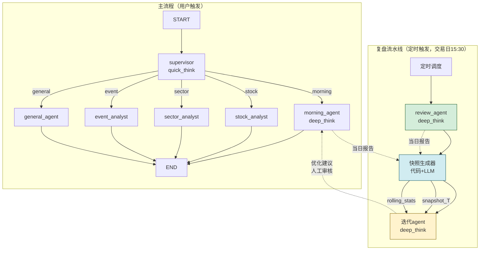

# 复盘 Agent + 迭代 Agent 设计文档

> 日期：2026-07-08
> 状态：已确认，待实现规划

## 1. 背景与目标

当前 `aistock-agent-py` 已有晨报 agent（morning），每日开盘前生成宏观分析报告。但缺少两个闭环环节：

1. **复盘**：收盘后对当日大盘走势做归因分析，判断"实际发生了什么、为什么"
2. **迭代**：对比晨报预测与复盘结果，量化偏离度，产出优化建议

目标：建立"预测 → 复盘 → 偏差分析 → 优化建议"的闭环流水线，通过人工审核逐步提升晨报质量。

## 2. 已确认的设计决策

| 决策项 | 结论 |
|--------|------|
| 复盘agent周期 | 单agent，参数化区分日/周/月（`{{PERIOD}}` 占位符） |
| 迭代agent优化方式 | B方案先行（人工审核），C方案远期演进（动态注入） |
| Agent地图 | 升级 README.md 的 Mermaid 图，不单独建文件 |
| 复盘触发方式 | 定时自动运行，每个交易日 15:30 收盘后触发 |
| 迭代触发方式 | 复盘完成后自动触发（流水线串联） |
| 报告存储 | 分层记忆：原始报告归档 + 轻量快照JSON + 滚动指标库 + manifest索引 |
| 板块匹配机制 | 两级匹配：代码字典精确匹配（第一级） + LLM语义兜底（第二级） |
| 迭代agent权限 | 只读 + 建议，禁止任何写操作（不改prompt、不改代码、不改数据文件） |
| 快照生成器 | 代码框架（确定性逻辑）+ LLM执行（语义判断）混合体 |

## 3. 整体架构

### 3.1 流水线时序

```
08:00  晨报agent (morning)
         ↓ 输出报告 → docs/agent-outputs/morning/ + Redis(2h TTL)
         ↓ SSE流式给用户

15:30  复盘agent (review) [定时触发，交易日]
         ↓ 读取收盘数据 + Tavily新闻
         ↓ 输出报告 → docs/agent-outputs/review/ + Redis(2h TTL)
         ↓ SSE流式给用户

15:35  快照生成器 (snapshot_builder) [代码框架+LLM]
         ↓ 读取当日晨报 + 当日复盘
         ↓ LLM执行4维度评估 → 生成 snapshot_T.json
         ↓ 代码更新 rolling_stats.json + manifest.json

15:40  迭代agent (iterate) [自动触发]
         ↓ 读 snapshot_T.json + rolling_stats.json
         ↓ 判断阈值 → 按需深挖原始报告
         ↓ 输出偏差分析报告 + 优化建议 → docs/agent-outputs/iterate/
```

非交易日或数据缺失时跳过整条流水线。

### 3.2 Mermaid 架构图（替换 README.md 拓扑图）



## 4. 复盘 Agent 设计

### 4.1 定位

与晨报agent对称的worker，走定时调度而非supervisor路由。支持日/周/月三种周期，通过 `{{PERIOD}}` 参数区分。

### 4.2 Prompt 框架（5步 + 标准化附录）

```
请扮演一位资深宏观策略分析师。根据{{PERIOD}}（{{DATE}}）A股收盘数据，进行一场客观的行情归因分析。

分析步骤（请严格按此顺序执行）：

## 步骤1：罗列核心变量（事实层）
检索并列出{{PERIOD}}内国内外发生的、对资本市场有潜在影响的前5大宏观事件、产业政策或外盘异动（基于实时搜索结果，不依赖训练数据）。

## 步骤2：匹配行情特征（数据层）
结合{{PERIOD}}A股主要指数涨跌、领涨领跌板块及量能变化，判断上述哪几项事件在时间节点和影响逻辑上与盘面走势最吻合。

## 步骤3：剔除噪音（排除层）
明确排除那些"看似相关、实则无因果"的干扰信息。

## 步骤4：输出核心结论（归因层）
总结出驱动{{PERIOD}}行情的Top 3核心逻辑链条，并完成各板块的归因。

## 步骤5：【强制执行】输出"标准化行情事实附录"
（此部分专供后续迭代Agent解析，严格按表格格式输出，数据客观、不掺杂预测）

### 附录A：主要指数表现
| 指数 | 收盘 | 涨跌幅 | 日内节奏描述 |
|------|------|--------|-------------|

### 附录B：板块表现矩阵（覆盖涨幅前5+跌幅前5+异动板块）
| 板块名称 | 涨跌幅 | 日内关键节点 | 核心归因 |
|---------|--------|-------------|---------|

### 附录C：关键事件实际影响追踪
| 事件名称 | 发生时间 | 实际影响板块 | 影响方向和程度 | 持续性判断 |
|---------|---------|------------|--------------|-----------|

### 附录D：今日异常信号记录
（记录与常规逻辑不符的异常现象）
```

### 4.3 工具集

| 工具 | 来源 | 说明 |
|------|------|------|
| `get_global_markets` | 已有 (yfinance) | 境外市场行情 |
| `tavily_finance_search` | 已有 | 全网财经新闻搜索 |
| `get_cls_news` | 已有 | 财联社快讯 |
| `get_market_summary` | 新增 (调Node.js) | A股收盘指数/资金面 |
| `get_sector_performance` | 新增 (调Node.js) | 板块涨跌明细 |

### 4.4 输出与存储

- SSE流式 + Redis缓存（key=`briefing:review:YYYY-MM-DD`，TTL=2h）
- 文件归档：`docs/agent-outputs/review/YYYY-MM-DD-HHMM-review.md`
- 调度脚本：`scripts/run_review_test.py`（参考 `run_morning_test.py` 模式）

## 5. 快照生成器设计（snapshot_builder）

### 5.1 定位

不是agent，是流水线中间件。代码控制流程，LLM只做语义判断。

### 5.2 代码职责（确定性，不可被LLM覆盖）

| 职责 | 说明 |
|------|------|
| 文件读写 | 读取晨报/复盘文件、写入snapshot/manifest/rolling_stats |
| JSON组装 | 把LLM返回的结构化结果组装成snapshot JSON |
| 指标计算 | MA5/MA10/MA20滑动平均，基于manifest历史数据 |
| manifest维护 | 追加当日记录，O(1)查询历史 |
| 板块匹配（第一级） | 字典精确匹配，命中直接计入overlap |
| 异常兜底 | LLM输出格式异常时，生成降级snapshot（标注error） |

### 5.3 LLM职责（语义判断，输出受JSON schema约束）

| 维度 | 输入 | 输出 |
|------|------|------|
| 维度一：板块语义匹配 | 代码未匹配的板块列表 | 语义等价对，自动追加到字典 |
| 维度二：方向-强度打分 | 两份报告中各板块的描述文本 | `{"板块": {"morning_score": +5, "review_score": +1, "deviation": -4}}` |
| 维度三：归因相似度 | 晨报归因链 vs 复盘归因链 | `{"板块": {"similarity": 4, "morning_cause": "...", "review_cause": "..."}}` |
| 维度四：情绪基调 | 两份报告全文 | `{"morning_sentiment": 0.6, "review_sentiment": 0.1, "bias": 0.5}` |

### 5.4 板块两级匹配机制

```
晨报板块列表 + 复盘板块列表
        │
        ▼
   第一级：代码字典精确匹配（sector_aliases.json）
   匹配命中 → 直接计入 overlap_hits
        │
        ▼（未命中的进入第二级）
   第二级：LLM语义匹配
   匹配命中 → 计入 overlap_hits + 代码自动追加到字典
        │
        ▼（仍未命中）
   判定为不匹配 → 分别计入 over_focused / missing
```

字典文件独立存放：`src/aistock_agent/data/sector_aliases.json`

```json
{
  "黄金": ["贵金属", "黄金概念"],
  "新能源车": ["新能源汽车", "新能源车产业链"],
  "军工": ["国防军工", "军工电子"],
  "航空": ["航空装备", "大飞机"]
}
```

字典维护策略：
- 初始字典：代码预置，覆盖A股常见板块别名（约30-50条）
- 动态扩充：LLM第二级匹配成功后，代码自动追加新映射
- 异常修正：迭代agent报告中发现匹配错误时，人工修正

### 5.5 snapshot_T.json 结构

```json
{
  "date": "2026-07-08",
  "morning_file": "docs/agent-outputs/morning/2026-07-08-0800-briefing.md",
  "review_file": "docs/agent-outputs/review/2026-07-08-1530-review.md",
  "dimension_1_coverage": {
    "overlap_hits": ["黄金", "新能源"],
    "missing_in_morning": ["军工"],
    "over_focused": ["航空"],
    "hit_rate": 0.67,
    "new_coverage_rate": 0.25
  },
  "dimension_2_direction": {
    "sectors": {
      "黄金": {"morning_score": 5, "review_score": 1, "deviation": -4},
      "航空": {"morning_score": -2, "review_score": -5, "deviation": -3}
    },
    "direction_accuracy": 0.5,
    "mean_deviation": -1.5,
    "abs_mean_deviation": 2.3
  },
  "dimension_3_attribution": {
    "sectors": {
      "黄金": {"similarity": 2, "morning_cause": "外盘期货大涨", "review_cause": "地缘避险"}
    },
    "attribution_match_rate": 0.33
  },
  "dimension_4_sentiment": {
    "morning_sentiment": 0.6,
    "review_sentiment": 0.1,
    "bias": 0.5
  }
}
```

### 5.6 rolling_stats.json 结构

```json
{
  "updated_at": "2026-07-08T15:35:00",
  "ma5": {
    "hit_rate": 0.62,
    "direction_accuracy": 0.55,
    "mean_deviation": 1.2,
    "attribution_match_rate": 0.40,
    "sentiment_bias": 0.08
  },
  "ma10": {
    "hit_rate": 0.58,
    "direction_accuracy": 0.50,
    "mean_deviation": 1.8,
    "attribution_match_rate": 0.35,
    "sentiment_bias": 0.12
  },
  "ma20": {
    "hit_rate": 0.60,
    "direction_accuracy": 0.52,
    "mean_deviation": 1.5,
    "attribution_match_rate": 0.38,
    "sentiment_bias": 0.15
  }
}
```

### 5.7 manifest.json 结构

```json
{
  "records": [
    {
      "date": "2026-07-08",
      "snapshot_file": "docs/agent-outputs/snapshots/2026-07-08.json",
      "hit_rate": 0.67,
      "direction_accuracy": 0.5,
      "mean_deviation": -1.5,
      "attribution_match_rate": 0.33,
      "sentiment_bias": 0.5
    }
  ]
}
```

## 6. 迭代 Agent 设计

### 6.1 定位

B方案（人工审核模式），产出偏差分析报告 + 优化建议，不自动改prompt。

### 6.2 执行逻辑

```
Step 1: 读 snapshot_T.json → 获取当日4维度数据
Step 2: 读 rolling_stats.json → 获取MA5/MA10/MA20趋势
Step 3: 阈值判断
        ├─ 全部正常 → 输出 {"status": "normal", "summary": "今日无显著异常"}
        └─ 触发阈值 → 进入Step 4
Step 4: 按需深挖（读manifest定位问题日期 → 读原始报告）
Step 5: LLM生成偏差分析报告 + 优化建议
```

### 6.3 阈值规则（代码硬编码，LLM不可改）

| 维度 | 触发条件 | 回看窗口 |
|------|----------|----------|
| 维度一：关注点重叠度 | hit_rate < 0.5 或 new_coverage_rate > 0.4 | MA5 |
| 维度二：方向-强度偏差 | abs(deviation) > 3 或 MA10均值偏差 > 1.5 | 当日 + MA10 |
| 维度三：归因一致性 | similarity < 3 | 当日 + MA5 |
| 维度四：情绪基调 | MA20 bias > 0.15 | MA20 |

### 6.4 四个分析维度

**维度一：关注点重叠度（Coverage Overlap）—— 检视"有没有漏看"**

- 晨报命中率 = 晨报提及的板块中复盘也提到的比例
- 复盘新增覆盖率 = 复盘提及的板块中晨报未提及的比例
- 迭代价值：新增覆盖率持续偏高（>40%）→ 晨报信息筛选机制有问题

**维度二：方向-强度偏差（Direction & Magnitude Deviation）—— 检视"判断准不准"**

- LLM将定性描述映射到统一强度标尺（-5到+5），计算差值
- 指标：方向准确率（DA）、强度偏差均值、绝对偏差均值
- 迭代价值：偏差均值持续为正 → 晨报系统性偏乐观，需增加下行风险检查

**维度三：归因一致性（Attribution Consistency）—— 检视"逻辑对不对"**

- 对比同一板块在晨报和复盘中的因果链
- 指标：归因方向一致率、归因完全匹配率
- 迭代价值：方向对但归因不一致 → 推理链脆弱，需强制推理链显式化

**维度四：叙事情绪校准（Narrative Sentiment Calibration）—— 检视"整体基调是否匹配"**

- 对两份报告全文做整体情感分析（-1到1），计算差值
- 指标：情绪基线偏差
- 迭代价值：连续20日偏差显著 → 风险偏好校准有问题，需增加市场环境分类前置判断

### 6.5 输出格式

```json
{
  "date": "2026-07-08",
  "status": "alert",
  "triggered_dimensions": ["dimension_2", "dimension_4"],
  "analysis": {
    "dimension_2": {
      "summary": "晨报对黄金板块严重高估（偏差-4），连续10日均值偏差+1.8，系统性偏乐观",
      "evidence_dates": ["2026-07-06", "2026-07-07", "2026-07-08"],
      "root_cause": "外盘大涨传导A股的置信度过高，未考虑A股独立性"
    },
    "dimension_4": {
      "summary": "近20日情绪基线偏差0.18，晨报长期偏乐观",
      "trend": "持续偏高，未见收敛"
    }
  },
  "optimization_suggestions": [
    {
      "target": "morning_prompt",
      "suggestion": "在步骤4增加'下行风险强制检查'环节，对外盘传导利好需标注置信度",
      "priority": "high",
      "evidence": "维度二MA10均值偏差连续超阈值"
    }
  ]
}
```

## 7. 边界划分（核心安全约束）

### 7.1 迭代agent权限

```
迭代agent可做的事（只读 + 建议）：
  ✅ 读取 snapshot / rolling_stats / manifest
  ✅ 按需读取原始晨报/复盘报告
  ✅ 生成偏差分析报告
  ✅ 生成优化建议（文本描述，不直接改代码）

迭代agent绝不可做的事（写操作全部禁止）：
  ❌ 修改 morning.py / review.py 的 prompt 文件
  ❌ 修改 snapshot_builder 的代码逻辑
  ❌ 修改 rolling_stats.json / manifest.json
  ❌ 修改阈值规则
  ❌ 直接注入上下文到晨报（C方案远期才做）
```

### 7.2 快照生成器代码边界

```
代码层（确定性，不可被LLM覆盖）：
  🔒 文件路径管理 / 读写调度
  🔒 JSON schema 校验
  🔒 MA5/MA10/MA20 计算
  🔒 manifest 追加逻辑
  🔒 板块字典第一级匹配
  🔒 异常降级（LLM失败 → 生成error快照）

LLM层（语义判断，可被优化建议间接改进）：
  🔓 板块语义匹配（第二级兜底）
  🔓 方向打分 / 归因相似度 / 情绪分析
  🔓 输出严格受JSON schema约束，格式错误由代码兜底
```

## 8. 存储结构

```
docs/agent-outputs/
├── morning/              # 原始晨报（永久保留，仅深挖时读取）
├── review/               # 原始复盘（永久保留，仅深挖时读取）
├── snapshots/            # 每日评估快照（轻量JSON）
│   └── YYYY-MM-DD.json
├── iterate/              # 迭代agent输出报告
│   └── YYYY-MM-DD.json
├── rolling_stats.json    # 滚动指标缓存（MA5/MA10/MA20）
└── manifest.json         # 汇总索引表（日期+指标值，O(1)查询）

src/aistock_agent/data/
└── sector_aliases.json   # 板块别名字典（可动态扩充）
```

## 9. 前置依赖：Tool Registry + 定时调度

### 9.1 执行路径

```
Step 1: Task 11（Tavily拆分）— Phase 5 遗留任务
        market_tools.py → 拆出 → search_tools.py + services/tavily.py
        ↓ （market_tools回归纯yfinance，import路径稳定）
Step 2: Tool Registry（工具注册中心）
        tools/registry.py → 集中管理所有工具集
        ↓ （agent声明category即可获取工具集，不再手动import拼接）
Step 3: 定时调度基础设施
        services/scheduler.py → APScheduler 集成
        ↓ （晨报08:50 + 复盘15:30 + 快照15:35 + 迭代15:40）
Step 4: 复盘agent + 迭代agent + 快照生成器
        按本文档第4-6节实现
```

### 9.2 Tool Registry 设计

当前各agent手动import工具并内联组装列表，工具复用已在发生（如 `get_capital_flow` 被 stock 和 sector 共用）但无统一管理。Phase 5 Task 11 拆分 Tavily 后，工具文件职责清晰，正好建registry。

**tools/registry.py**:

```python
"""工具注册中心 — 按 category 集中管理工具集

agent 只需声明 category，即可获取完整工具列表，
不再手动 import + 拼接。
"""

from aistock_agent.tools.market_tools import get_global_markets
from aistock_agent.tools.search_tools import tavily_finance_search
from aistock_agent.tools.news_tools import get_cls_news, search_cls_news
from aistock_agent.tools.stock_tools import get_quote, get_capital_flow, get_profit_forecast
from aistock_agent.tools.sector_tools import get_leader_stocks
from aistock_agent.tools.review_tools import get_market_summary, get_sector_performance

# 按 category 分组
TOOL_REGISTRY: dict[str, list] = {
    "morning": [tavily_finance_search, get_global_markets, get_cls_news],
    "stock": [get_quote, get_capital_flow, get_profit_forecast, search_cls_news],
    "sector": [get_leader_stocks, get_capital_flow],
    "review": [tavily_finance_search, get_global_markets, get_cls_news,
               get_market_summary, get_sector_performance],
    "iterate": [],  # 迭代agent无工具，纯读文件+LLM推理
}

__all__ = [
    "get_global_markets", "tavily_finance_search", "get_cls_news",
    "search_cls_news", "get_quote", "get_capital_flow", "get_profit_forecast",
    "get_leader_stocks", "get_market_summary", "get_sector_performance",
    "get_tools", "get_all_tools",
]


def get_all_tools() -> list:
    """获取全部工具（去重）"""
    seen: set[int] = set()
    result = []
    for tools in TOOL_REGISTRY.values():
        for tool in tools:
            if id(tool) not in seen:
                seen.add(id(tool))
                result.append(tool)
    return result


def get_tools(category: str | None = None) -> list:
    """获取工具集

    Args:
        category: 工具分类名（如 "morning"、"review"）。
                  不传或传 None → 返回全部工具（去重）。
                  传具体名称 → 返回该分类的工具列表。
    """
    if category is None:
        return get_all_tools()
    return TOOL_REGISTRY.get(category, [])
```

三种使用方式：

```python
# 方式1：默认导入全部
from aistock_agent.tools.registry import get_tools
tools = get_tools()  # 全部工具

# 方式2：按 category 命名控制
tools = get_tools("morning")  # 只拿晨报工具集

# 方式3：直接 import 具体工具名
from aistock_agent.tools.registry import get_global_markets, tavily_finance_search
```

现有4个agent（morning/stock/sector/event）在 Step 2 中一并迁移到 registry。

### 9.3 定时调度设计

当前无调度基础设施，只有手动测试脚本 `scripts/run_morning_test.py`。引入 APScheduler 实现定时触发。

**services/scheduler.py**:

```python
"""定时调度服务 — APScheduler 集成

调度任务（均为交易日执行，非交易日自动跳过）：
  08:50  晨报生成（写Redis，用户打开App命中缓存）
  15:30  复盘生成
  15:35  快照生成
  15:40  迭代分析
"""
```

调度时序：

| 时间 | 任务 | 输出 | 推送 |
|------|------|------|------|
| 08:50 | 晨报生成 | Redis缓存 + 文件归档 | 无（用户打开App命中缓存） |
| 15:30 | 复盘生成 | Redis缓存 + 文件归档 | 无 |
| 15:35 | 快照生成 | snapshot JSON + rolling_stats + manifest | 无 |
| 15:40 | 迭代分析 | 偏差分析报告 + 优化建议 | 无 |

**推送暂不实现**：前端设计未定，后期统一设计推送通道（WebSocket / 企业微信 / 钉钉等）。当前阶段用户通过App主动请求命中Redis缓存即可获取晨报。

非交易日判断：复用 `utils/date.py` 的 `is_trading_day()`，scheduler 在每个任务执行前检查，非交易日直接跳过。

调度集成方式：
- 在 `main.py` 的 lifespan 中启动 scheduler
- 关闭时优雅停止（`scheduler.shutdown(wait=True)`）
- 与 RedisPool / HttpClientPool 同生命周期管理

## 10. 新增/修改文件清单

### 10.1 新增文件

```
src/aistock_agent/
├── agents/workers/
│   ├── review.py              # 复盘agent
│   └── iterate.py             # 迭代agent
├── prompts/workers/
│   ├── review.py              # 复盘prompt（5步框架+附录）
│   └── iterate.py             # 迭代prompt（4维度分析+建议生成）
├── tools/
│   ├── registry.py            # 工具注册中心（新增）
│   ├── search_tools.py        # Tavily搜索工具（Task 11拆分产出）
│   └── review_tools.py        # 复盘专用工具：get_market_summary, get_sector_performance
├── services/
│   ├── snapshot_builder.py    # 快照生成器（代码框架+LLM调用）
│   ├── scheduler.py           # 定时调度服务（APScheduler）
│   └── tavily.py              # Tavily客户端封装（Task 11拆分产出）
├── data/
│   └── sector_aliases.json    # 板块别名字典
└── scripts/
    ├── run_review_test.py     # 复盘手动测试脚本
    └── run_pipeline.py        # 全流水线手动测试脚本（复盘→快照→迭代）
```

### 10.2 修改文件

```
src/aistock_agent/
├── tools/market_tools.py          # Task 11: 移除tavily_finance_search，回归纯yfinance
├── agents/workers/morning.py      # 迁移到registry + import路径改search_tools
├── agents/workers/stock.py        # 迁移到registry
├── agents/workers/sector.py       # 迁移到registry
├── agents/workers/event.py        # 迁移到registry + import路径改search_tools
├── main.py                        # 集成scheduler到lifespan
├── config.py                      # 新增调度相关配置项
└── api/routes.py                  # import路径改search_tools

tests/
├── unit/test_search_tools.py      # 新增（Task 11）
├── unit/test_market_tools.py      # 修改（移除tavily测试）
├── unit/test_registry.py          # 新增（registry测试）
├── unit/test_scheduler.py         # 新增（调度测试）
├── unit/test_snapshot_builder.py  # 新增
├── integration/test_review_agent.py   # 新增
└── integration/test_iterate_agent.py  # 新增

README.md                           # 拓扑图换Mermaid + 目录结构更新
```

## 11. 远期演进路径

1. **当前阶段（B方案）**：迭代agent产出报告，人工审核后手动优化晨报prompt
2. **中期（C方案）**：将人工确认有效的优化规则，提炼为动态上下文注入晨报system prompt
3. **远期（A方案）**：在系统和数据都足够成熟后，考虑自动反馈闭环（需版本管理、A/B验证等基础设施）
