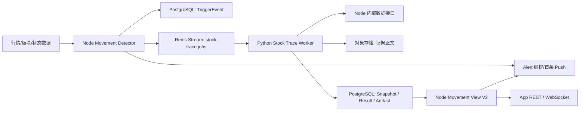
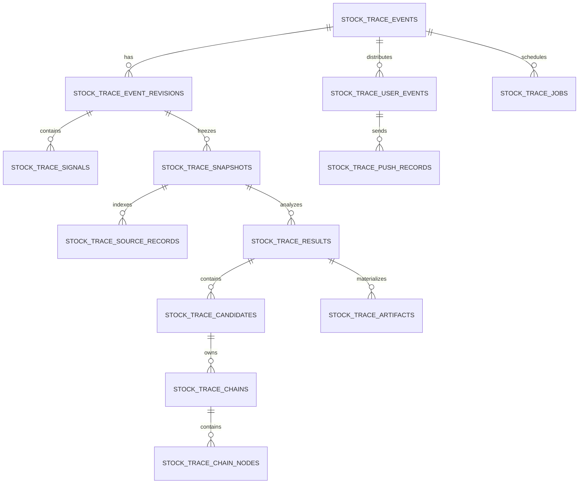

# 异动捕手 Agent 重构技术规范（SPEC）

> 文档版本：V1.0  
> 修改日期：2026-07-29  
> 依据文档：[异动捕手-Agent-重构-PRD.md](./异动捕手-Agent-重构-PRD.md) V1.3-Final  
> 适用范围：A 股自选股异动的 `stock_trace` 领域模块及 Alert 编排层  
> 评审对象：产品、算法/Agent、Node 后端、Python 后端、App 前端、数据、测试、运维、合规

## 1. 目标与边界

### 1.1 目标

实现可审计的四段式链路：

```text
行情/规则 -> TriggerEvent -> StockTraceSnapshot -> StockTraceResult -> StockTraceArtifact
```

- `event_id` 是全链路的稳定业务主键，格式固定为 `mv:{symbol}:{trading_date}:{first_trigger_ms}:{direction}`。
- Node 规则引擎决定是否触发；Python Agent 不参与阈值判断。
- 每个快照、结果和 Artifact 必须可追溯至同一事件及指定的 `trigger_revision`。
- Alert 只承担用户关联、首条提醒、频控、二次补推和前端交付；归因、证据、快照和校验属于独立 `stock_trace` 模块。

### 1.2 非目标

- 不修改 Market Trace/Review 的 Schema、存储和流程；只参考其“事实冻结、受限归因、证据校验”的方法。
- 不将 Hot Burst（机构调研共振）写入候选归因或证据链。
- P0 不覆盖 ST、新股、退市整理、北交所证券。
- P0 不让 AI Advisor 消费 Artifact，仅提供受鉴权的只读接口。
- 不提供交易指令；建议动作仅限核验、观察、提醒和阅读。

## 2. 总体架构与职责



| 组件 | 所属服务 | 职责 | 禁止承担的职责 |
|---|---|---|---|
| Movement Detector | Node/TypeScript | 行情规则、事件合并、revision、TriggerEvent 入库、任务发布 | 新闻归因、LLM 调用 |
| Alert Orchestrator | Node/TypeScript | 自选股映射、首条 Push、二次补推判定、用户定向通知 | 生成公共归因结果 |
| Stock Trace Worker | Python/FastAPI Worker | 读取事件、并行采集、快照冻结、受限 LLM 归因、Validator、Artifact 回写 | A 股数据抓取、用户级数据存储 |
| Stock Trace Repository | Node/TypeScript | 事务性持久化、Artifact 查询、Movement View 投影、生命周期清理 | 模型归因判断 |
| Redis Streams | Redis | 跨进程任务投递、消费者组、重试和死信 | 事实或 Artifact 的唯一持久化来源 |
| PostgreSQL | PostgreSQL | 事件、快照、结果、Artifact、用户关联和审计索引的权威存储 | 新闻/公告全文存储 |
| 对象存储 | S3 兼容 OSS/MinIO | 公告、新闻等原始正文及必要附件 | 供前端直接无鉴权访问 |

## 3. 推荐技术选型

| 层级 | 推荐选型 | 选择理由 | 不采用的方案 |
|---|---|---|---|
| Node 领域服务 | 现有 Express 5 + TypeScript + Zod | 仓库已使用 Express、`pg`、Redis 和 Zod；新增模块可沿用现有中间件、鉴权和 WebSocket 通道，避免引入第二个 Node 框架 | 不迁移 NestJS，重构范围与本项目无关 |
| Python Agent 服务 | 现有 FastAPI + Pydantic v2 + LangGraph | 已有 API、Pydantic Schema、LLM 工厂、HTTPX 和可观测体系；适合单次受限推理与结构化输出 | 不将异动 Trace 直接塞入原 Alert 自由文本 Agent |
| 关系型存储 | PostgreSQL 15+，JSONB 仅保存可演进载荷 | 事件版本、外键、幂等唯一约束、JSONB、部分索引和生命周期清理均为核心需求；现有 Node 已使用 PostgreSQL | 不使用 Redis 或文件作为事实与 Artifact 主存储 |
| 异步任务 | Redis Streams + Consumer Group | 项目已具备 Redis；支持 `XADD/XREADGROUP/XACK`、pending reclaim、死信和多 Worker 扩展，满足 5 秒/30 秒时序下的至少一次投递 | 不用进程内队列，进程重启会丢任务；P0 不新引入 Kafka |
| 缓存/互斥 | 现有 Redis（短 TTL） | 用于 `event_id + trigger_revision + analysis_version` 分布式锁、短期读缓存和 SSE 进度，权威幂等仍由 DB 约束保证 | 不以缓存命中替代 Artifact 校验 |
| 证据正文 | S3 兼容对象存储（生产 OSS/COS/S3；开发 MinIO） | 大文本与附件不应进入 PostgreSQL；支持生命周期规则、权限控制、内容哈希和低成本留存 | 不将原始新闻全文复制至 DB JSONB |
| 数据访问 | Python `httpx` 调 Node `/internal/*`；Node 使用 `pg` 参数化 SQL | 符合现有“Node 负责 A 股数据层，Python 不重复抓取”的工程边界 | Python 直连行情/公告生产源或直连 Node 数据库 |
| Schema 校验 | Pydantic v2（Python）+ Zod（Node）+ DB 约束 | 分别覆盖服务入口、LLM 输出、跨服务边界和持久化一致性 | 仅凭 LLM JSON 可解析即展示 |
| 可观测性 | structlog JSON 日志 + Prometheus/OpenTelemetry 指标接口 | 将 `event_id`、revision、snapshot、job 与 request_id 串联，支持 SLA 和误归因排查 | 只记录自由文本日志 |

### 3.1 一致性与时序策略

1. Node 在一个 PostgreSQL 事务中写入事件/revision/事实，并写入 Outbox 记录；事务提交后由 Outbox Publisher 追加 Redis Stream。
2. Python Worker 以 `event_id + trigger_revision + analysis_version` 获取 Redis 锁，再按 `GET /internal/stock-trace/events/{event_id}` 获取权威事件。
3. Snapshot、Result、Artifact 的唯一约束决定最终幂等；Redis 锁仅降低重复 LLM 调用概率。
4. 初版快照在事件入库后 5 秒内生成；三层采集完成或事件触发后 30 秒生成增强版。超过 30 秒生成 `partial` Artifact，后续数据到齐可产生新的 Artifact 版本。
5. 上游事实修订只创建 `corrected` 快照及其后续 Artifact，严禁 `UPDATE` 覆盖已冻结的快照内容。

## 4. 状态机、版本和幂等

### 4.1 标识和版本

| 标识 | 生成方 | 格式/约束 |
|---|---|---|
| `event_id` | Node Detector | `mv:{symbol}:{trading_date}:{first_trigger_ms}:{direction}`；创建后不可变 |
| `trigger_revision` | Node Detector | 从 `1` 递增；绝对幅度增加 >= 2 个百分点或严重度提升时递增 |
| `snapshot_id` | Python | UUIDv7；每次 initial/enriched/corrected 均新建 |
| `result_id` | Python | UUIDv7；一份结果只对应一个 snapshot |
| `artifact_id` | Python | UUIDv7；仅 Validator 成功后生成 |
| `analysis_version` | Python 配置 | 如 `stock-trace-v1.0`；影响提示词/策略时递增 |
| `confidence_config_version` | Node/Python 配置中心 | 如 `v1.0`；变更权重时新建版本，历史 Artifact 不回写 |

### 4.2 状态迁移

```text
TriggerEvent: active -> superseded（仅同一事件被新 revision 替代为当前视图）
处理状态: detected -> snapshotting -> analyzing -> completed
                                     \-> partial
                                     \-> failed
归因状态: confirmed | hypothesis | insufficient | not_applicable
```

- `completed + insufficient` 合法，表示分析已结束但无可验证直接原因。
- `failed` 仅代表执行失败；不得用 `failed` 替代证据不足。
- revision 更新不改变 `event_id`。回归阈值内至少 5 分钟后再次越界，创建新 `event_id`，并通过 `related_event_id` 关联。

### 4.3 幂等键

| 操作 | 幂等键 | 数据库保障 |
|---|---|---|
| 创建事件 | `event_id` | `stock_trace_events(event_id)` 主键 |
| 写入 revision | `event_id + trigger_revision` | 唯一约束 |
| 创建快照 | `event_id + trigger_revision + snapshot_stage + source_revision_hash` | 唯一约束；corrected 的 hash 必须不同 |
| 创建分析任务 | `event_id + trigger_revision + analysis_version` | 唯一约束 |
| 写入 Artifact | `event_id + snapshot_id + analysis_version` | 唯一约束 |
| 二次 Push | `user_id + event_id + push_kind=secondary` | 唯一约束，保证最多一次 |

## 5. 数据模型

### 5.1 类型约定

| 逻辑类型 | PostgreSQL 类型 | 约定 |
|---|---|---|
| 主键 UUID | `uuid` | 应用生成 UUIDv7，提升时间顺序索引局部性 |
| 时间 | `timestamptz` | 全部以 UTC 写入；API 使用 ISO 8601，App 按上海时区展示 |
| 交易日 | `date` | 中国交易日，非字符串 |
| 金额/价格/比例 | `numeric(20,6)` | 避免浮点精度问题；百分比使用数值 `7.000000`，不存 `0.07` |
| 枚举 | `varchar(n)` + `CHECK` | 便于演进，不创建 PostgreSQL enum |
| 结构化弹性字段 | `jsonb` | 只用于原始载荷、规则快照和展示投影；关键关联字段不可藏在 JSONB |
| 内容哈希 | `char(64)` | SHA-256 小写十六进制 |

### 5.2 实体关系



### 5.3 核心事实表

#### 5.3.1 `stock_trace_events`

事件的稳定根对象，一行对应一个 `event_id`。

| 字段 | 类型 | 空 | 约束/说明 |
|---|---|---:|---|
| `event_id` | `varchar(96)` | 否 | PK；格式校验 `^mv:\d{6}:\d{4}-\d{2}-\d{2}:\d{13}:(up|down)$` |
| `symbol` | `char(6)` | 否 | 股票代码 |
| `stock_name` | `varchar(64)` | 否 | 触发时名称快照 |
| `exchange` | `varchar(8)` | 否 | `SH`/`SZ` |
| `security_type` | `varchar(16)` | 否 | P0 固定 `a_share` |
| `trading_date` | `date` | 否 | 事件首触发交易日 |
| `direction` | `varchar(8)` | 否 | `up`/`down` |
| `first_triggered_at` | `timestamptz` | 否 | event_id 的时间来源 |
| `window_start` | `timestamptz` | 否 | 初始异动窗口起点 |
| `window_end` | `timestamptz` | 否 | 当前 revision 窗口终点 |
| `event_status` | `varchar(16)` | 否 | `active`/`superseded`；仅描述事件关系，不替代处理状态 |
| `current_trigger_revision` | `integer` | 否 | 默认 `1`，`CHECK >= 1` |
| `current_severity` | `varchar(8)` | 否 | `low`/`medium`/`high`/`critical` |
| `processing_status` | `varchar(16)` | 否 | `detected`/`snapshotting`/`analyzing`/`completed`/`partial`/`failed` |
| `related_event_id` | `varchar(96)` | 是 | FK 自关联；阈值回归后新事件关联旧事件 |
| `created_at` | `timestamptz` | 否 | 默认 `now()` |
| `updated_at` | `timestamptz` | 否 | 仅更新当前读模型状态，不改历史 revision |

索引：`(symbol, trading_date, direction, first_triggered_at DESC)`、`(processing_status, updated_at)`、`(related_event_id)`。

#### 5.3.2 `stock_trace_event_revisions`

记录规则事实与事件窗口演进；历史 revision 不更新。

| 字段 | 类型 | 空 | 约束/说明 |
|---|---|---:|---|
| `id` | `uuid` | 否 | PK |
| `event_id` | `varchar(96)` | 否 | FK -> `stock_trace_events.event_id` |
| `trigger_revision` | `integer` | 否 | 与 event 唯一 |
| `primary_rule_code` | `varchar(64)` | 否 | 如 `price_change_pct` |
| `rule_version` | `varchar(32)` | 否 | 规则配置版本 |
| `rule_snapshot` | `jsonb` | 否 | 阈值及开关的冻结副本 |
| `window_start` | `timestamptz` | 否 | revision 时间窗起点 |
| `window_end` | `timestamptz` | 否 | revision 时间窗终点 |
| `threshold` | `numeric(20,6)` | 否 | 命中阈值 |
| `actual_value` | `numeric(20,6)` | 否 | 当前观测值 |
| `baseline` | `numeric(20,6)` | 是 | 成交量/波动率等基线 |
| `severity` | `varchar(8)` | 否 | 当前严重度 |
| `data_quality` | `varchar(16)` | 否 | `complete`/`partial`/`stale` |
| `detected_at` | `timestamptz` | 否 | 检测时间 |
| `revision_reason` | `varchar(32)` | 否 | `initial`/`amplitude_expanded`/`severity_upgraded`/`fact_corrected` |
| `created_at` | `timestamptz` | 否 | 默认 `now()` |

约束：`UNIQUE(event_id, trigger_revision)`；`CHECK(window_end >= window_start)`。

#### 5.3.3 `stock_trace_signals`

一条 revision 包含一到多个异动信号，支持 15 分钟内同向合并。

| 字段 | 类型 | 空 | 约束/说明 |
|---|---|---:|---|
| `signal_id` | `uuid` | 否 | PK；会被 causal node 的 observable result 引用 |
| `event_id` | `varchar(96)` | 否 | FK -> events |
| `trigger_revision` | `integer` | 否 | 与 revision 联合 FK |
| `signal_type` | `varchar(24)` | 否 | `price`/`volume`/`volatility`/`limit`/`capital_flow`/`capital_divergence` |
| `direction` | `varchar(8)` | 否 | `up`/`down`/`neutral` |
| `rule_code` | `varchar(64)` | 否 | 实际命中规则 |
| `actual_value` | `numeric(20,6)` | 否 | 原始测量值 |
| `baseline_value` | `numeric(20,6)` | 是 | 比较基线 |
| `unit` | `varchar(24)` | 否 | `pct`/`yuan`/`ratio`/`count` |
| `occurred_at` | `timestamptz` | 否 | 事实发生时间 |
| `source_ref` | `varchar(256)` | 否 | 上游行情记录 ID 或稳定定位符 |
| `payload` | `jsonb` | 否 | 额外事实字段 |

约束：`UNIQUE(event_id, trigger_revision, signal_type, rule_code, occurred_at)`；资金开关关闭时，禁止 `signal_type in ('capital_flow','capital_divergence')` 写入生产事件。

### 5.4 快照与证据表

#### 5.4.1 `stock_trace_snapshots`

| 字段 | 类型 | 空 | 约束/说明 |
|---|---|---:|---|
| `snapshot_id` | `uuid` | 否 | PK |
| `event_id` | `varchar(96)` | 否 | FK -> events |
| `trigger_revision` | `integer` | 否 | 与 revision 联合 FK |
| `snapshot_stage` | `varchar(12)` | 否 | `initial`/`enriched`/`corrected` |
| `source_revision_hash` | `char(64)` | 否 | `trigger_event + ordered source hashes + collector versions` 的 SHA-256 |
| `trigger_event_json` | `jsonb` | 否 | 完整冻结的 TriggerEvent/revision/signals |
| `missing_fields` | `jsonb` | 否 | 字符串数组 |
| `data_readiness` | `jsonb` | 否 | company/sector/market 的 `complete`/`partial`/`missing` 状态 |
| `collector_versions` | `jsonb` | 否 | 每个 collector 版本与配置 |
| `captured_at` | `timestamptz` | 否 | 事实冻结时间 |
| `supersedes_snapshot_id` | `uuid` | 是 | corrected/enriched 指向被替代的较早快照 |
| `expires_at` | `timestamptz` | 否 | `captured_at + 30 days` |
| `created_at` | `timestamptz` | 否 | 默认 `now()` |

约束：`UNIQUE(event_id, trigger_revision, snapshot_stage, source_revision_hash)`；禁止更新 `trigger_event_json`、`source_revision_hash`、`captured_at`。

#### 5.4.2 `stock_trace_source_records`

`StockSourceRecord` 的持久化索引。正文在对象存储时，`content_excerpt` 仅保存受合规控制的短摘要。

| 字段 | 类型 | 空 | 约束/说明 |
|---|---|---:|---|
| `source_pk` | `uuid` | 否 | PK |
| `snapshot_id` | `uuid` | 否 | FK -> snapshots |
| `source_id` | `varchar(128)` | 否 | 快照内稳定 ID；`UNIQUE(snapshot_id, source_id)` |
| `kind` | `varchar(24)` | 否 | `trigger_fact`/`quote_fact`/`volume_fact`/`volatility_fact`/`limit_fact`/`capital_flow_fact`/`sector_fact`/`market_fact`/`announcement`/`news` |
| `provider` | `varchar(64)` | 否 | 数据提供方 |
| `source_level` | `varchar(16)` | 否 | `A`/`B`/`C`/`D` |
| `title` | `varchar(512)` | 否 | 标题或事实名称 |
| `content_excerpt` | `text` | 否 | 短摘要；不得替代原始正文 |
| `canonical_url` | `text` | 是 | 规范化 URL |
| `source_ref` | `varchar(256)` | 是 | 提供方内部 ID |
| `symbol` | `char(6)` | 是 | 个股/标的相关证据填写 |
| `window_start` | `timestamptz` | 是 | 证据覆盖窗口 |
| `window_end` | `timestamptz` | 是 | 证据覆盖窗口 |
| `occurred_at` | `timestamptz` | 是 | 事件发生/发布时间 |
| `captured_at` | `timestamptz` | 否 | 系统获取时间 |
| `freshness_seconds` | `integer` | 是 | 采集时的时效；负值非法 |
| `payload` | `jsonb` | 否 | 结构化行情/板块字段 |
| `content_hash` | `char(64)` | 否 | 正文或规范化内容 SHA-256 |
| `object_key` | `varchar(512)` | 是 | 原文对象键；仅受鉴权服务读取 |
| `object_etag` | `varchar(128)` | 是 | 对象版本/ETag |
| `created_at` | `timestamptz` | 否 | 默认 `now()` |

索引：`(snapshot_id, source_level)`、`(snapshot_id, occurred_at)`、`(content_hash)`、`(canonical_url)`。

### 5.5 归因与 Artifact 表

#### 5.5.1 `stock_trace_results`

| 字段 | 类型 | 空 | 约束/说明 |
|---|---|---:|---|
| `result_id` | `uuid` | 否 | PK |
| `event_id` | `varchar(96)` | 否 | FK -> events；与 snapshot 一致 |
| `snapshot_id` | `uuid` | 否 | FK -> snapshots |
| `analysis_version` | `varchar(32)` | 否 | 幂等键组成部分 |
| `model_provider` | `varchar(32)` | 否 | 模型提供方 |
| `model_version` | `varchar(128)` | 否 | 精确模型版本 |
| `processing_status` | `varchar(16)` | 否 | `completed`/`partial`/`failed` |
| `attribution_status` | `varchar(16)` | 否 | `confirmed`/`hypothesis`/`insufficient`/`not_applicable` |
| `primary_chain_id` | `uuid` | 是 | FK -> chains；confirmed/hypothesis 时可填 |
| `alternative_chain_id` | `uuid` | 是 | FK -> chains；不得等于 primary |
| `confidence_score` | `numeric(4,3)` | 是 | `CHECK >=0 AND <=0.950` |
| `confidence_level` | `varchar(8)` | 是 | `high`/`medium`/`low` |
| `confidence_config_version` | `varchar(32)` | 否 | 置信度配置版本 |
| `contradictions` | `jsonb` | 否 | 反证/冲突列表 |
| `unresolved_questions` | `jsonb` | 否 | 字符串数组，insufficient 时非空 |
| `missing_capabilities` | `jsonb` | 否 | 如 `capital_flow_disabled` |
| `suggested_actions` | `jsonb` | 否 | 受限动作枚举数组 |
| `raw_model_output` | `jsonb` | 是 | 仅内部短期调试，不对用户输出；不保存无引用正文 |
| `validation_status` | `varchar(16)` | 否 | `pending`/`passed`/`rejected` |
| `validation_errors` | `jsonb` | 否 | Validator 错误码数组 |
| `created_at` | `timestamptz` | 否 | 默认 `now()` |

约束：`UNIQUE(event_id, snapshot_id, analysis_version)`；`confirmed` 必须有 `confidence_score >= 0.750`、主链和 `validation_status='passed'`。

#### 5.5.2 `stock_trace_candidates`

| 字段 | 类型 | 空 | 约束/说明 |
|---|---|---:|---|
| `candidate_id` | `uuid` | 否 | PK |
| `result_id` | `uuid` | 否 | FK -> results |
| `layer` | `varchar(12)` | 否 | `company`/`sector`/`market` |
| `rank` | `smallint` | 否 | 同层排序，从 1 起 |
| `status` | `varchar(16)` | 否 | `supported`/`weak`/`rejected`/`insufficient` |
| `verdict` | `text` | 否 | 受限归因结论 |
| `supporting_evidence_ids` | `jsonb` | 否 | 仅存 source_id 数组 |
| `counter_evidence_ids` | `jsonb` | 否 | 仅存 source_id 数组 |
| `created_at` | `timestamptz` | 否 | 默认 `now()` |

约束：`UNIQUE(result_id, layer, rank)`；每个 result 的三层均至少有一行，材料不足时写 `insufficient`。

#### 5.5.3 `stock_trace_chains` 与 `stock_trace_chain_nodes`

`stock_trace_chains`：

| 字段 | 类型 | 空 | 约束/说明 |
|---|---|---:|---|
| `chain_id` | `uuid` | 否 | PK |
| `result_id` | `uuid` | 否 | FK -> results |
| `candidate_id` | `uuid` | 否 | FK -> candidates |
| `chain_role` | `varchar(16)` | 否 | `primary`/`alternative` |
| `created_at` | `timestamptz` | 否 | 默认 `now()` |

`stock_trace_chain_nodes`：

| 字段 | 类型 | 空 | 约束/说明 |
|---|---|---:|---|
| `node_id` | `uuid` | 否 | PK |
| `chain_id` | `uuid` | 否 | FK -> chains |
| `stage` | `varchar(24)` | 否 | 六阶段之一：`structural_root`、`trigger`、`transmission`、`exposure`、`repricing`、`observable_result` |
| `stage_order` | `smallint` | 否 | 固定 1-6 |
| `epistemic_type` | `varchar(12)` | 否 | `fact`/`inference`/`hypothesis` |
| `status` | `varchar(20)` | 否 | `established`/`partial`/`not_established` |
| `claim` | `text` | 否 | not_established 只允许标准缺失说明 |
| `evidence_ids` | `jsonb` | 否 | source_id 数组；fact 节点不得为空 |
| `counter_evidence_ids` | `jsonb` | 否 | source_id 数组 |
| `created_at` | `timestamptz` | 否 | 默认 `now()` |

约束：`UNIQUE(chain_id, stage)`、`UNIQUE(chain_id, stage_order)`；`observable_result` 必须引用 TriggerEvent 对应 `signal_id` 映射出的 `trigger_fact`。

#### 5.5.4 `stock_trace_artifacts`

仅保存 Validator 成功后的用户可读工件。

| 字段 | 类型 | 空 | 约束/说明 |
|---|---|---:|---|
| `artifact_id` | `uuid` | 否 | PK |
| `event_id` | `varchar(96)` | 否 | FK -> events |
| `snapshot_id` | `uuid` | 否 | FK -> snapshots |
| `result_id` | `uuid` | 否 | FK -> results |
| `artifact_version` | `integer` | 否 | 同 event 单调递增 |
| `analysis_version` | `varchar(32)` | 否 | 与 result 一致 |
| `artifact_json` | `jsonb` | 否 | `StockTraceArtifact` 完整结构，不存原文正文 |
| `movement_view_json` | `jsonb` | 否 | `movement-view-v2` 投影，前端直接消费 |
| `validation_report_json` | `jsonb` | 否 | 通过的规则、警告、证据索引 |
| `is_effective` | `boolean` | 否 | 同 event 至多一个有效 Artifact |
| `supersedes_artifact_id` | `uuid` | 是 | FK 自关联 |
| `created_at` | `timestamptz` | 否 | 默认 `now()` |
| `expires_at` | `timestamptz` | 否 | `created_at + 180 days` |

约束：`UNIQUE(event_id, snapshot_id, analysis_version)`、`UNIQUE(event_id, artifact_version)`；部分唯一索引 `UNIQUE(event_id) WHERE is_effective`。

### 5.6 任务、用户与推送表

#### 5.6.1 `stock_trace_jobs`

| 字段 | 类型 | 空 | 约束/说明 |
|---|---|---:|---|
| `job_id` | `uuid` | 否 | PK |
| `event_id` | `varchar(96)` | 否 | FK -> events |
| `trigger_revision` | `integer` | 否 | 当前需处理 revision |
| `analysis_version` | `varchar(32)` | 否 | 分析版本 |
| `job_kind` | `varchar(16)` | 否 | `initial`/`enrich`/`correct`/`retry` |
| `status` | `varchar(16)` | 否 | `queued`/`running`/`succeeded`/`failed`/`dead_letter` |
| `attempt_count` | `smallint` | 否 | 默认 0 |
| `available_at` | `timestamptz` | 否 | 延迟执行时间 |
| `stream_message_id` | `varchar(64)` | 是 | Redis Stream message ID |
| `last_error_code` | `varchar(64)` | 是 | 稳定错误码 |
| `last_error_detail` | `text` | 是 | 脱敏错误摘要 |
| `created_at` | `timestamptz` | 否 | 默认 `now()` |
| `updated_at` | `timestamptz` | 否 | 默认 `now()` |

约束：`UNIQUE(event_id, trigger_revision, analysis_version, job_kind)`。

#### 5.6.2 `stock_trace_user_events`

公共事件与自选用户的关联，不进入公共 Artifact。

| 字段 | 类型 | 空 | 约束/说明 |
|---|---|---:|---|
| `id` | `uuid` | 否 | PK |
| `user_id` | `uuid` | 否 | FK -> 现有 users |
| `event_id` | `varchar(96)` | 否 | FK -> events |
| `watchlist_id` | `uuid` | 是 | FK -> 现有自选组 |
| `first_seen_at` | `timestamptz` | 否 | 用户首次匹配事件时间 |
| `read_at` | `timestamptz` | 是 | 已读时间 |
| `notification_status` | `varchar(16)` | 否 | `pending`/`sent`/`failed`/`muted` |
| `created_at` | `timestamptz` | 否 | 默认 `now()` |

约束：`UNIQUE(user_id, event_id)`；索引 `(user_id, created_at DESC)`。

#### 5.6.3 `stock_trace_push_records`

| 字段 | 类型 | 空 | 约束/说明 |
|---|---|---:|---|
| `push_id` | `uuid` | 否 | PK |
| `user_event_id` | `uuid` | 否 | FK -> user events |
| `event_id` | `varchar(96)` | 否 | 冗余索引用于频控 |
| `push_kind` | `varchar(16)` | 否 | `initial`/`secondary` |
| `trigger_reason` | `varchar(64)` | 否 | `event_created`/`severity_upgraded`/`a_grade_major_cause` |
| `artifact_id` | `uuid` | 是 | secondary 必填；initial 允许为空 |
| `channel` | `varchar(24)` | 否 | `app`/`websocket`/`wechat` |
| `status` | `varchar(16)` | 否 | `queued`/`sent`/`failed` |
| `sent_at` | `timestamptz` | 是 | 实际发送时间 |
| `created_at` | `timestamptz` | 否 | 默认 `now()` |

约束：`UNIQUE(user_event_id, push_kind)`；secondary 只允许由严重度升级或新增 A 级重大主因触发。

### 5.7 Outbox、清理与审计

| 表 | 核心字段 | 说明 |
|---|---|---|
| `stock_trace_outbox` | `outbox_id uuid PK`、`aggregate_id event_id`、`event_type`、`payload jsonb`、`published_at`、`attempt_count` | 与 TriggerEvent/revision 同事务写入，确保数据库提交后最终投递 Redis |
| `stock_trace_cleanup_log` | `cleanup_id uuid PK`、`resource_type`、`resource_id`、`object_key_hash`、`deleted_at`、`status` | 只留最小审计信息，不保留已删除正文 |
| `stock_trace_rule_configs` | `rule_version PK`、`config jsonb`、`capital_flow_enabled boolean`、`effective_from`、`approved_by` | 规则和开关版本化；资金默认关闭 |
| `stock_trace_confidence_configs` | `confidence_config_version PK`、`weights jsonb`、`effective_from`、`calibration_report_ref` | 保存回放校准结果引用，不覆盖历史 Artifact |

### 5.8 生命周期与删除顺序

1. 快照及其证据正文在 `expires_at`（30 天）到期后删除；Artifact 在 180 天到期后删除。
2. 对带对象正文的证据，先调用对象存储删除并确认，再删除 `object_key`、证据索引和关联快照/Artifact。
3. 删除失败记录入 `stock_trace_cleanup_log` 并重试；失败期间不得删除 DB 指针。
4. `stock_trace_events`、`stock_trace_user_events`、推送送达记录和聚合统计不因 Artifact 到期而删除。

## 6. 对象契约

### 6.1 `StockSourceRecord`

```json
{
  "source_id": "NEWS_cls_20260729_001",
  "kind": "news",
  "provider": "cls",
  "source_level": "B",
  "title": "示例新闻标题",
  "content": "仅在 Worker 内存或对象存储正文中使用",
  "url": "https://example.com/news/001",
  "source_ref": "001",
  "symbol": "600519",
  "window_start": "2026-07-29T01:30:00Z",
  "window_end": "2026-07-29T02:00:00Z",
  "occurred_at": "2026-07-29T01:45:00Z",
  "captured_at": "2026-07-29T01:50:03Z",
  "freshness_seconds": 303,
  "payload": {},
  "content_hash": "sha256-hex"
}
```

字段语义与 Market Trace `SourceRecord` 对齐，但本对象独立定义、独立版本化，不继承或修改市场领域类。

### 6.2 `StockTraceArtifact` 最小结构

```json
{
  "schema_version": "stock-trace-artifact-v1",
  "artifact_id": "019...",
  "artifact_version": 2,
  "event_id": "mv:600519:2026-07-29:1753752600000:up",
  "snapshot": { "snapshot_id": "019...", "stage": "enriched" },
  "result": {
    "result_id": "019...",
    "processing_status": "completed",
    "attribution_status": "confirmed",
    "confidence": { "score": 0.81, "level": "high", "config_version": "v1.0" },
    "candidates": { "company": [], "sector": [], "market": [] },
    "primary_chain_id": "019...",
    "alternative_chain_id": null,
    "contradictions": [],
    "unresolved_questions": [],
    "suggested_actions": ["verify_announcement", "observe"]
  },
  "validation_report": { "status": "passed", "rules": [] },
  "created_at": "2026-07-29T02:00:00Z"
}
```

### 6.3 Validator 必须执行的规则

1. Result、Snapshot、Artifact 的 `event_id` 一致；Result 的 snapshot 必须属于该 event/revision。
2. 所有 `evidence_ids` 必须存在于指定 Snapshot，且 `source_id` 与快照字典 key 一致。
3. `observable_result` 必须指向 TriggerEvent 的触发信号事实。
4. `confirmed` 仅接受：A 级可追溯事件证据，或 B 级事件证据加实体/方向/时间窗一致的独立市场事实；D 级证据不得确认主因。
5. 触发证据发生时间不得晚于 `window_end`；事后新闻只标记补充，不能作为直接 trigger。
6. `not_established` 节点可交付，但不得带入虚构具体事实；fact 节点的 `evidence_ids` 不得为空。
7. 价格、资金、板块方向冲突时，必须填入反证或冲突说明。
8. Schema 或跨对象校验失败时，不写有效 Artifact，不向 App 返回原始模型文本。

## 7. REST API 规范

### 7.1 通用约定

- 内部接口携带 `X-Internal-Token`；用户接口使用现有 JWT/Session 中间件。
- JSON 使用 `application/json; charset=utf-8`；时间为 ISO 8601 UTC；金额及比例以 JSON number 返回。
- 内部成功响应统一为 `{ "code": 200, "data": {...} }`，与现有 `NodeApiClient` 兼容。
- 用户成功响应统一为 `{ "code": 200, "data": {...}, "request_id": "..." }`。
- 失败响应：`{ "code": <http_status>, "error": { "code": "STOCK_TRACE_*", "message": "...", "details": [] }, "request_id": "..." }`。
- `POST` 写接口支持 `Idempotency-Key`；缺失时由服务按业务幂等键处理，但客户端重试必须传入。

### 7.2 Node 内部领域接口

| 方法 | 路径 | 调用方 | 用途 | 请求/响应要点 |
|---|---|---|---|---|
| `POST` | `/internal/stock-trace/events` | Detector | 创建事件或新增 revision | Body: `TriggerEvent`; 返回 `event_id`、`trigger_revision`、`created`、`job_id` |
| `GET` | `/internal/stock-trace/events/{eventId}` | Python Worker | 精确读取当前事件及指定 revision 的事实 | Query: `trigger_revision` 可选；返回 event、revision、signals |
| `GET` | `/internal/stock-trace/events/{eventId}/revisions/{revision}` | Python Worker/测试 | 读取不可变 revision | 404 表示不存在 |
| `POST` | `/internal/stock-trace/events/{eventId}/jobs` | Node/Python | 创建或幂等重试分析任务 | Body: `trigger_revision, analysis_version, job_kind` |
| `PATCH` | `/internal/stock-trace/jobs/{jobId}` | Python Worker | 回报任务状态/失败码 | Body: `status, attempt_count, last_error_code` |
| `POST` | `/internal/stock-trace/snapshots` | Python Worker | 写入不可变 Snapshot 和证据索引 | Body: `StockTraceSnapshot`; 201 或幂等 200 |
| `GET` | `/internal/stock-trace/snapshots/{snapshotId}` | Python Worker/运维 | 读取快照及证据索引 | `include_content=false` 默认 |
| `POST` | `/internal/stock-trace/artifacts` | Python Worker | 回写已通过校验的 Artifact | Body 包含 artifact、validation_report；校验失败返回 422 |
| `GET` | `/internal/stock-trace/artifacts/{eventId}` | Python/AI Advisor 预留 | 读取最新有效 Artifact 或指定版本 | Query: `artifact_version`、`include_evidence`，默认 false |
| `GET` | `/internal/stock-trace/artifacts/{eventId}/versions` | 运维/回放 | 查看可读版本元数据 | 不返回原文正文 |
| `POST` | `/internal/stock-trace/cleanup` | Scheduler | 执行生命周期清理 | Body: `dry_run`；仅内部管理权限 |
| `GET` | `/internal/stock-trace/rule-configs/{ruleVersion}` | Python Worker | 读取冻结规则版本 | 资金开关、阈值和生效时间 |
| `GET` | `/internal/stock-trace/confidence-configs/{version}` | Python Worker | 读取置信度权重版本 | 返回校准引用 |

#### 7.2.1 Node 向 Python 提供的采集上下文接口

以下接口是 Stock Trace Worker 的唯一 A 股数据入口。所有响应均应包含 `captured_at`、`provider`、`freshness_seconds` 和可定位的 `source_ref`；为空是合法业务结果，依赖不可用必须用 HTTP 503 或响应中的 `status=degraded` 区分。

| 方法 | 路径 | 用途 | 关键返回字段 |
|---|---|---|---|
| `GET` | `/internal/stock-trace/events/{eventId}/quote-context` | 生成 initial 的触发时行情与历史基线 | `quote, previous_close, intraday_bars, volume_baseline, security_status, source_records[]` |
| `GET` | `/internal/stock-trace/events/{eventId}/company-context` | 获取公告、新闻、公司业务映射及其证据 | `announcements[], news[], company_profile, source_records[]` |
| `GET` | `/internal/stock-trace/events/{eventId}/sector-context` | 获取同花顺行业/概念/地域/特色板块及成分表现 | `boards[], constituents_breadth, leaders, source_records[]` |
| `GET` | `/internal/stock-trace/events/{eventId}/market-context` | 获取宽基、市场广度、风格及宏观市场事实 | `indexes[], breadth, style_facts, source_records[]` |
| `GET` | `/internal/stock-trace/events/{eventId}/capital-flow-context` | 获取资金流事实；仅开关已启用时可用 | `status, flow, baseline, source_records[]`；关闭时返回 `status=disabled` |

公共 Query：`trigger_revision`（必填）、`window_start`/`window_end`（服务端按 revision 校验后可省略）。Python 不得传入任意 symbol 改写事件上下文，也不得将这些接口替换为直连第三方数据源。

### 7.3 Python Stock Trace 服务接口

| 方法 | 路径 | 调用方 | 用途 | 请求/响应要点 |
|---|---|---|---|---|
| `POST` | `/internal/stock-trace/jobs/consume` | Redis Consumer Adapter | 处理一个指定 job | Body: `job_id`; 仅测试/恢复用途，生产由 Worker 消费 Stream |
| `POST` | `/internal/stock-trace/events/{eventId}/analyze` | Node 重试适配 | 创建或触发幂等分析 | Body: `trigger_revision, analysis_version, mode`；返回 202 和 job 状态 |
| `GET` | `/internal/stock-trace/events/{eventId}/progress` | Node SSE 代理 | 获取处理进度 | 返回 `processing_status`、阶段、更新时间、可重试信息 |
| `GET` | `/agent/stock-trace/stream` | App/Node 代理 | SSE 进度流 | Query: `event_id`；事件类型见 7.5 |
| `GET` | `/internal/stock-trace/health` | Node/运维 | Worker 依赖与消费延迟健康检查 | 返回 Redis、Node API、LLM、pending job 指标 |

说明：Python API 不成为 Artifact 权威读库；用户读取统一走 Node。上述 Python 接口仅用于作业编排、进度转发及运维。

### 7.4 用户 REST 接口

| 方法 | 路径 | 鉴权 | 功能 | Query/Body | 成功响应 |
|---|---|---|---|---|---|
| `GET` | `/api/cn/favorites/movements` | 用户 | 自选股异动列表 | `cursor,limit<=50,signal_type,status,direction,from,to` | `items[]`、`next_cursor` |
| `GET` | `/api/cn/favorites/movements/{eventId}` | 用户且存在用户关联 | 异动事实与 Movement View V2 | 无 | TriggerEvent 摘要、最新状态、卡片展示数据 |
| `GET` | `/api/cn/favorites/movements/{eventId}/analysis` | 用户且存在用户关联 | 完整已校验归因 | `artifact_version` 可选 | Artifact；不存在有效 Artifact 时返回处理状态，不返回原始 LLM 文本 |
| `POST` | `/api/cn/favorites/movements/{eventId}/analyze` | 用户且存在用户关联 | 发起或重试分析 | `{ "force": false }` | `202`，返回 job/progress；同事件幂等 |
| `POST` | `/api/cn/favorites/movements/{eventId}/read` | 用户且存在用户关联 | 标记已读 | 空 body | `read_at` |
| `GET` | `/api/cn/favorites/movements/{eventId}/evidence/{sourceId}` | 用户且存在用户关联 | 获取单条证据元数据或受控跳转 | `artifact_version` 可选 | 来源、标题、时间、等级、跳转 URL；正文按版权策略返回 |

权限规则：任何用户接口均需先验证 `stock_trace_user_events(user_id,event_id)`；不得通过猜测 event_id 读取其他用户自选股提醒。

### 7.5 SSE 与 WebSocket 事件

SSE：`GET /agent/stock-trace/stream?event_id={eventId}`。鉴权由 Node 代理或 Python 内部 token 验证。事件格式：

```text
event: movement.progress | movement.updated | movement.failed
id: {event_id}:{artifact_version_or_timestamp}
data: { "event_id": "...", "processing_status": "...", "artifact_version": 2, "updated_at": "..." }
```

Node WebSocket 对用户定向发送：

- `movement.created`：首次 TriggerEvent 与首条 Push 对应。
- `movement.updated`：状态变化、Artifact 有效版本变更或允许的二次 Push。
- WebSocket 非可靠消息通道；客户端断线恢复必须用列表游标 REST 补拉。

### 7.6 错误码与 HTTP 状态

| HTTP | 业务错误码 | 触发条件 | 客户端行为 |
|---:|---|---|---|
| 400 | `STOCK_TRACE_INVALID_EVENT_ID` | event_id 格式非法 | 不重试 |
| 401/403 | `STOCK_TRACE_FORBIDDEN` | 内部 token 或用户事件授权失败 | 重新鉴权，不泄露存在性 |
| 404 | `STOCK_TRACE_EVENT_NOT_FOUND` | 事件不存在或无用户关联 | 不调用 LLM |
| 409 | `STOCK_TRACE_JOB_RUNNING` | 同幂等键正在执行 | 读取 progress/SSE |
| 409 | `STOCK_TRACE_ARTIFACT_CONFLICT` | 有效版本并发切换冲突 | 重读最新版本 |
| 422 | `STOCK_TRACE_CONTRACT_INVALID` | TriggerEvent/Snapshot/Artifact Schema 不合法 | 记录契约错误，禁止展示 |
| 422 | `STOCK_TRACE_VALIDATION_REJECTED` | 证据、时间窗或因果链校验不通过 | 降级为 partial/failed，不展示模型原文 |
| 429 | `STOCK_TRACE_RETRY_LIMITED` | 用户手工重试过频 | 按 `Retry-After` 处理 |
| 503 | `STOCK_TRACE_DEPENDENCY_UNAVAILABLE` | Node/Redis/LLM 依赖不可用 | 首条 Alert 仍可用；分析显示处理中或部分结果 |

## 8. Redis Streams、任务重试和降级

### 8.1 Stream 定义

| 项目 | 值 |
|---|---|
| 主 Stream | `stock-trace.jobs` |
| 消费组 | `stock-trace-workers` |
| 死信 Stream | `stock-trace.jobs.dlq` |
| 消息字段 | `job_id,event_id,trigger_revision,analysis_version,job_kind,created_at` |
| Consumer 名称 | `{hostname}:{pid}` |
| 交付语义 | 至少一次；由 DB 唯一约束实现幂等 |

### 8.2 重试

- 采集依赖失败：在 30 秒窗口内允许一次短重试；仍失败则生成 partial，不阻塞其他层。
- LLM Schema 失败：允许一次定向结构修复；仍失败写 `failed`，不得无界重试。
- Redis pending 超过 60 秒由 reclaim worker 认领；同一任务最多 3 次。超过上限转入 DLQ 并告警。
- 人工/API 重试创建 `job_kind=retry`，但同一 `event_id + trigger_revision + analysis_version` 仍不允许并发多次 LLM 调用。

### 8.3 降级矩阵

| 故障 | 事件/Push | Snapshot/Artifact | 对用户展示 |
|---|---|---|---|
| 资讯/公告不可用 | 不影响 | 对应候选为 `insufficient` | “部分资讯源暂不可用” |
| 板块/市场不可用 | 不影响 | 对应层为 `insufficient` | 明示数据缺失 |
| 资金能力未验收 | 不影响其他四类 | 不采集/不确认/不展示资金结论 | 不展示资金异常标签 |
| LLM 不可用 | 不影响首条 Push | 任务 failed，可重试 | 显示触发事实与“原因暂不可用” |
| Redis 不可用 | Node 同步写 DB + Outbox | Publisher 恢复后补投递 | 首条 Push 正常，Trace 延迟 |
| Artifact 校验失败 | 不影响首条 Push | 不写有效 Artifact | 不展示原始模型文本 |

## 9. 建议项目目录结构

### 9.1 Python：`aistock-agent-py`

```text
src/aistock_agent/
├── api/
│   ├── routes.py                         # 现有入口，注册 stock_trace_router
│   └── stock_trace.py                    # Python 内部分析、进度、健康接口
├── schemas/
│   ├── stock_trace.py                    # TriggerEvent/Snapshot/Result/Artifact/StockSourceRecord
│   └── stock_trace_api.py                # Python 内部 API request/response schema
├── services/
│   ├── stock_trace_snapshot.py           # 并行采集和不可变快照构建
│   ├── stock_trace_collector.py          # company/sector/market collectors 编排
│   ├── stock_trace_attribution.py        # 单次受限 LLM 调用与解析
│   ├── stock_trace_validator.py          # Schema + 跨对象确定性校验
│   ├── stock_trace_repository.py         # 调 Node internal trace API
│   ├── stock_trace_jobs.py               # Redis Streams consumer/reclaim/DLQ
│   └── stock_trace_progress.py           # Redis 进度与 SSE 发布
├── agents/
│   └── workers/
│       └── stock_trace.py                # Worker 入口；非原 alert.py
├── prompts/
│   └── workers/
│       └── stock_trace.py                # 严格 JSON、三层候选、六阶段链 prompt
├── tools/
│   ├── stock_trace_tools.py              # 仅封装 Node 内部数据读取，均使用 safe_tool_call
│   └── ...
├── workers/
│   └── stock_trace_consumer.py           # 独立进程启动入口
└── tests/
    ├── unit/
    │   ├── test_stock_trace_schemas.py
    │   ├── test_stock_trace_snapshot.py
    │   ├── test_stock_trace_validator.py
    │   └── test_stock_trace_jobs.py
    ├── integration/
    │   └── test_stock_trace_worker.py
    └── e2e/
        └── test_stock_trace_flow.py
```

约束：`agents/workers/alert.py` 仅保留兼容入口或用户交付适配；不得继续承载归因提示词、证据解析或 Artifact 拼装。

### 9.2 Node：`aistock-app-api`

```text
src/
├── core/
│   ├── db.ts
│   ├── redis.ts
│   └── ws/
│       └── channels/
│           └── alert-channel.ts          # 复用用户定向 movement.updated
├── db/
│   └── migrations/
│       ├── 0xx_stock_trace_events.sql
│       ├── 0xx_stock_trace_snapshots.sql
│       ├── 0xx_stock_trace_artifacts.sql
│       └── 0xx_stock_trace_lifecycle.sql
├── modules/
│   └── stock-trace/
│       ├── types.ts                       # Zod schema 与领域类型
│       ├── repository.ts                  # 参数化 SQL、事务与查询
│       ├── eventService.ts                # event/revision/upsert/outbox
│       ├── artifactService.ts             # Artifact 写入、有效版本切换、视图投影
│       ├── jobService.ts                  # job、outbox publisher、Stream 发布
│       ├── lifecycleService.ts            # 30/180 天清理
│       ├── alertOrchestrator.ts           # 用户映射、二次 Push 规则
│       ├── internalController.ts          # /internal/stock-trace/*
│       ├── controller.ts                  # /api/cn/favorites/movements/*
│       └── __tests__/
│           ├── eventService.spec.ts
│           ├── artifactService.spec.ts
│           └── authorization.spec.ts
└── index.ts                                # 注册 controller 和 scheduler
```

约束：`modules/monitor/MovementInsightService.ts` 可作为迁移参考，但不得继续扩展为 Stock Trace 的事实源、归因服务或持久化替代。

## 10. 安全、监控与验收映射

### 10.1 安全与合规

- 所有 `/internal/stock-trace/*` 必须校验 `X-Internal-Token`，并仅接受服务网段访问。
- 用户读接口先校验 `stock_trace_user_events`，不以 symbol 或 event_id 的可猜测性作为权限边界。
- 对象存储桶私有；前端取证据正文使用后端鉴权后的短期签名 URL，默认仅返回元数据和来源跳转。
- 日志不得记录新闻/公告全文、访问 token 或用户自选股清单；可记录 `event_id`、`snapshot_id`、`source_id`、哈希和错误码。

### 10.2 关键指标

| 指标 | 标签 | 告警阈值/目标 |
|---|---|---|
| `stock_trace_initial_latency_seconds` | rule_version, result | P95 <= 5 秒 |
| `stock_trace_enriched_latency_seconds` | result | P95 <= 30 秒 |
| `stock_trace_job_total` | job_kind,status,error_code | DLQ > 0 告警 |
| `stock_trace_validation_total` | status,rule_code | rejected 比率异常告警 |
| `stock_trace_artifact_total` | attribution_status,stage | 监控 partial/failed 占比 |
| `stock_trace_llm_calls_total` | analysis_version,model | 同幂等键重复调用为 0 |
| `stock_trace_push_total` | push_kind,reason,status | secondary 每 event/user 最多一次 |
| `stock_trace_cleanup_total` | resource_type,status | 删除失败持续 24 小时告警 |

### 10.3 PRD 验收的技术落点

| PRD 验收重点 | 技术实现 |
|---|---|
| 初版 5 秒、增强版 30 秒 | outbox + Redis Streams、初版/增强版独立 job、延迟指标 |
| 不可覆盖快照 | insert-only 表、唯一约束、禁止修改触发器/仓储接口 |
| A 或 B+独立事实确认 | `stock_trace_validator.py` 与 Node Artifact 入库双重校验 |
| 未建立节点不编造 | Pydantic 枚举、prompt 约束、Validator 检查 fact 证据 |
| 资金能力默认关闭 | `stock_trace_rule_configs.capital_flow_enabled=false` 与 detector 写入门禁 |
| Artifact 180 天、快照 30 天 | `expires_at`、对象存储生命周期、清理审计任务 |
| 二次 Push 最多一次 | `stock_trace_push_records` 唯一约束和 Alert Orchestrator 条件判断 |
| AI Advisor 不接入 P0 | 仅内部 Artifact GET；不注册业务消费任务或 UI 流程 |

## 11. 实施顺序

1. 建立 PostgreSQL migration、Zod/Pydantic 契约和 Node 内部事件/Artifact API。
2. 完成 Detector 的事件/revision/Outbox 写入及 Alert 首条 Push；特殊证券过滤和资金开关同时落地。
3. 部署 Redis Streams Worker，完成 initial Snapshot、5 秒 SLA、进度状态和 Artifact 空壳。
4. 接入 company/sector/market 并行采集、对象存储、enriched/partial/corrected 流程。
5. 接入受限 LLM、六阶段链和 Validator；完成 A/B/D 证据门槛自动测试。
6. 完成 Movement View V2、REST/SSE/WebSocket、用户授权和二次 Push。
7. 以至少 5 个交易日回放校准置信度，完成 30/180 天清理演练后灰度。

## 12. 明确实施约束

- 不得以 `symbol + cycle` 定位生产 Trace；只接受 `event_id`。
- 不得让 Python 绕过 Node 重新抓取 A 股行情、板块、公告或用户自选关系。
- 不得把任何用户 ID、已读状态、Push 状态写入公共 Snapshot、Result 或 Artifact。
- 不得使用 Hot Burst 作为异动候选原因、证据或任务依赖。
- 不得在验证失败时降级展示原始 LLM 自由文本。
- 不得修改现有 `MarketTraceSnapshot` 或市场收盘 Review 流程；若以后抽取公共基类，必须保持两个领域对外契约不变。
