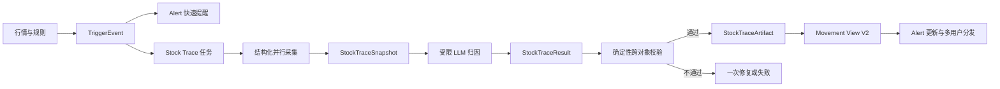

# 异动捕手 Agent 重构 PRD

> 文档版本：V1.3-Final  
> 修改日期：2026-07-29  
> 评审对象：产品、算法/Agent、Node 后端、App 前端、测试、数据、合规  
> 目标版本：Stock Trace V1 + Movement View V2  
> 优先级：P0

## 0. 已冻结决策

### 0.1 本次已冻结决策

| 编号 | 决策结论 | 落地约束 |
|---|---|---|
| D01 | `event_id` 固定使用 `mv:{symbol}:{trading_date}:{first_trigger_ms}:{direction}`；事件升级只增加 `trigger_revision`，不改变 `event_id` | 内部精确读取固定为 `GET /internal/stock-trace/events/:eventId`；禁止仅用 `symbol + cycle` 定位生产异动事件 |
| D02 | 科创板指统一为科创综指 `000680.SH`；板块统一采用同花顺口径 | 行业使用 `881xxx`，概念使用 `885xxx/886xxx`，地域/特色板块同样采用同花顺标准；成分、排名、涨跌幅、资金流和板块解释不得混用申万或中证口径 |
| D03 | 成交量、波动率、涨跌停、资金异动按第 4.4.3 节默认值开发 | 所有阈值配置化并带规则版本；资金能力受生产数据源可用性开关控制 |
| D04 | P0 排除 ST、新股、退市整理和北交所证券 | 规则引擎在 TriggerEvent 生成前过滤；特殊交易制度证券后续另立规则版本后再纳入 |
| D05 | 本期独立定义 `StockSourceRecord` | 禁止修改或扩展市场 Trace 的 `SourceRecord`；仅复用字段语义，后续再评估抽取公共基类 |
| D06 | TriggerEvent 入库后 5 秒内生成 `initial`，关键数据齐备或最迟 30 秒生成 `enriched`，事实修订生成 `corrected` | 支持渐进式分析；所有快照不可覆盖、通过版本关系关联 |
| D07 | 六阶段链允许 `not_established` 节点 | 保留统一框架；不完整链只能以 `hypothesis/insufficient` 交付，不得编造节点事实 |
| D08 | `confirmed` 主因采用 A 级证据，或 B 级事件证据加独立市场事实 | D 级证据不得确认主因；确认条件由 Validator 确定性执行 |
| D09 | 资金规则参数按 V1 开发，但资金能力默认关闭 | 仅在供应商口径、数据授权和 SLA 通过数据服务验收后，以配置版本开启；否则保持关闭能力，不阻塞其他四类异动上线 |
| D10 | Artifact、索引和短摘要存 DB；大体量证据正文存对象存储 | Artifact 保存 180 天，中间快照保存 30 天；DB 保存索引、短摘要和校验哈希 |
| D11 | 二次 Push 仅发生在严重度升级，或新确认 A 级重大原因时 | 同一 event_id 最多补推一次；其他完成结果仅更新 App |
| D12 | 置信度采用版本化初值并进行回放校准 | 灰度前完成至少 5 个交易日回放；配置调整发布新版本，不覆盖历史置信度 |
| D13 | 本期不接入 AI Advisor 消费链路，仅预留 Artifact 查询接口 | AI Advisor 不重新生成 Trace，后续只允许读取已校验 Artifact |

其他已知约束：首期只覆盖 A 股自选股；确定性规则由 Node 规则引擎执行；LLM 不决定是否触发；建议动作只包含核验、观察、提醒和阅读，不包含确定性交易指令。

## 1. 变更摘要

### 1.1 一句话说明

将异动捕手从“Alert 内部直接生成分析文本”调整为“Alert 负责实时提醒与用户交付、独立 `stock_trace` 负责事件级事实冻结、证据归因、结果校验和可复用工件”的双层架构。

### 1.2 变更类型

- **新增功能**：新增 `TriggerEvent -> StockTraceSnapshot -> StockTraceResult -> StockTraceArtifact` 完整链路。
- **修改逻辑**：将三份自由文本子 Agent 汇总改为结构化数据采集、统一快照、单次受限归因和确定性校验。
- **删除功能**：新链路不再把产业链补涨标的推荐作为异动归因输出；不再从 Markdown 正则提取核心字段。
- **降级方案**：允许盘中数据部分缺失，输出 `partial/hypothesis/insufficient`，但异动事实和首次提醒不受 Agent 失败影响。
- **接口调整**：所有分析入口改为稳定 `event_id` 定位；新增事件、快照、工件内部接口。
- **数据源调整**：统一为可引用的 `StockSourceRecord`，增加数据新鲜度、事件时间窗和原始来源标识。
- **交互调整**：列表先展示触发事实，详情随后更新归因；展示事实、推断、假设及未解问题。
- **验收标准调整**：新增四段式对象绑定、六阶段链、证据引用、时间先后、不可变快照和跨用户隔离测试。

## 2. 影响范围分析

### 2.1 用户场景

- 自选股达到异动阈值后，用户先收到确定性事实提醒，再看到逐步补全的原因分析。
- 用户可区分“已确认原因”“较可能解释”“待验证假设”和“原因不足”。
- 用户从 Push、列表、个股详情进入时均通过同一个 `event_id` 查看同一份结果。
- 多名用户关注同一股票时共享公共 Stock Trace，不重复分析，但各自的已读、推送和订阅状态独立。

### 2.2 功能模块

| 模块 | 影响 |
|---|---|
| 异动规则引擎 | 继续负责触发，但必须产出标准 `TriggerEvent` 和稳定 `event_id` |
| Alert | 收缩为入口、任务触发、用户映射、频控、状态同步和推送编排层 |
| Stock Trace | 新增领域模块，负责快照、证据、归因、校验、Artifact 和公共缓存 |
| Market Trace/Review | 不修改流程、模型和存储；只参考其设计思想 |
| Hot Burst | 明确排除，不作为异动候选原因或证据聚合模块 |
| 个股情报/公告 | 继续独立存在，可作为 Stock Trace 证据来源 |
| AI Advisor/播报 | 本期仅预留已验证 StockTraceArtifact 的只读查询接口，不接入消费链路；后续消费时不得重新生成归因 |

### 2.3 数据源

- 实时行情、历史 K 线、资金流、板块指数、行业/概念映射、公告、新闻和市场宽基事实继续使用现有 Node 数据层。
- 每条输入必须转换为带稳定 `source_id` 的 `StockSourceRecord`。
- 新增事件窗口、新鲜度、来源等级、原始记录 ID、抓取时间和结构化载荷要求。
- Python 不重复实现 A 股数据抓取。

### 2.4 Agent 流程

原流程：`symbol -> 三个自由文本子 Agent -> Master 文本/JSON`。

新流程：`event_id -> TriggerEvent -> 并行事实采集 -> 不可变 StockTraceSnapshot -> 单次受限 LLM -> StockTraceResult -> 确定性校验 -> StockTraceArtifact`。

### 2.5 前端页面和接口

- 异动列表、详情、Push、SSE、WebSocket 全部以 `event_id` 为主键。
- 前端直接消费 Movement View V2，不解析 Markdown。
- 新增 `detected/snapshotting/analyzing/completed/partial/failed` 处理状态。
- 新增事实、推断、假设标签和未解问题展示。

### 2.6 验收标准

- 在原阈值、去重、性能和权限验收基础上，新增四段式关联、不可变快照、证据真实性、六阶段链和公共分析复用验收。
- `StockTraceResult` 通过 Schema 仅代表格式正确，必须通过跨对象确定性校验后才能生成 Artifact 并对用户展示。

## 3. 原 PRD 需要修改的章节

| 原章节 | 修改原因 | 修改方式 | 修改后要点 |
|---|---|---|---|
| 产品背景与重构目标 | 原方案未明确 Alert 与归因领域边界 | 修改逻辑 | Alert 负责交付，Stock Trace 负责事件级可追溯归因 |
| 功能范围 | 原方案将快照、归因、推送混在异动捕手内部 | 修改并新增 | 增加四段式 Trace；明确 Market Review 和 Hot Burst 不在改造范围 |
| 异动判定规则 | 缺少标准 TriggerEvent 契约 | 新增 | 规则命中必须产出事件时间窗、规则快照、量化事实和稳定 ID |
| 原因归因逻辑 | 原因链只有 2-5 个自由节点，与市场 Trace 不一致 | 修改 | 采用适配个股语义的六阶段链，增加事实/推断/假设和节点建立状态 |
| 数据源与优先级 | 只描述来源，未形成统一证据对象 | 修改 | 引入 StockSourceRecord；复用 SourceRecord 语义但不修改市场类 |
| 输出结构 | 原 `movement-v2` 是单一扁平结果 | 重大修改 | 拆为四个版本化对象；Movement View V2 仅作为 App 读模型 |
| Agent 调用链路 | 三个自由文本子 Agent 易丢失证据绑定 | 修改 | 并行采集结构化事实，统一快照后执行一次受限归因 |
| 页面/接口 | SSE 仍可按 symbol/cycle 发起 | 接口调整 | 生产分析必须使用 event_id；symbol/cycle 仅保留临时兼容 |
| 异常与兜底 | 单快照无法处理盘中数据后到 | 修改 | 支持 initial/enriched/corrected 多版本不可变快照 |
| 验收标准 | 缺少跨对象校验和 Artifact 交付门禁 | 增强 | 增加证据 ID、时间因果、六阶段、幂等和跨用户隔离测试 |
| 研发拆分 | Python Alert 承担过多职责 | 修改 | 新增 stock_trace schema/service/validator/repository；Alert 成为适配层 |

## 4. 详细修改方案

### 4.1 背景与问题定义

当前项目已有事件级异动分析雏形，但仍存在以下落地问题：

1. 公共 SSE 入口主要使用 `symbol + cycle`，不能确保分析的是用户点击的那一次异动。
2. Alert 同时承担事件读取、数据检索、多个子 Agent、Master 合成、缓存和推送，职责过重。
3. 子 Agent 输出自由文本，Master 无法稳定验证其中事实是否真实存在、来自何处、是否早于异动。
4. 当前结构化结果只有分析内容，没有独立不可变快照和完整 Artifact，无法重建当时的判断依据。
5. 当前异动类型主要覆盖价格和成交量，尚未完整承载波动率、涨跌停和资金信号。
6. 同一股票异动可能对应大量自选用户，若分析与用户 Alert 绑定，会重复调用模型并产生不一致结果。

因此，本次重构将异动捕手拆成两个边界明确的领域：

```text
Alert：什么时候提醒谁、通过什么渠道交付
Stock Trace：这次异动为什么发生、依据是什么、哪些仍不确定
```

### 4.2 目标与非目标

#### 目标

1. 建立事件级、可追溯、可校验、可复用的个股异动归因能力。
2. 使用稳定 `event_id` 串联触发事实、快照、结果、工件和用户提醒。
3. 将确定性检测与不确定性归因解耦，Agent 失败不影响事件入库和首次提醒。
4. 复用市场 Trace 的证据 ID、因果链和跨对象校验思想，同时保持领域模型隔离。
5. 让一个公共异动只分析一次，再分发给所有相关用户。
6. 为个股详情、播报和日终复盘提供统一 StockTraceArtifact，并为 AI Advisor 预留只读查询接口。

#### 非目标

- 不修改 `MarketTraceSnapshot`、市场收盘 Review 流程、缓存或归档逻辑。
- 不将 Hot Burst 机构调研共振并入异动捕手。
- 不由 LLM 判断异动是否触发、涨跌停价格或证券交易状态。
- 不输出自动交易、仓位、止损或确定性涨跌预测。
- 不在 P0 支持港股、美股、基金、期货、期权和可转债。
- 不在 P0 支持 ST、新股、退市整理及北交所证券；上述标的在规则引擎生成 TriggerEvent 前过滤，不产生用户提醒或 Stock Trace。
- 不要求每一次异动都必须找到具体新闻原因。
- 本期不接入 AI Advisor 的消费链路；AI Advisor 不得触发重新归因，只能在后续版本读取已校验 Artifact。

### 4.3 核心需求

#### 4.3.1 领域边界

| 领域 | 负责 | 不负责 |
|---|---|---|
| Alert | 用户订阅、事件接收、去重频控、触发 Trace、处理状态、已读未读、REST/SSE/WebSocket/Push | 证据可信度、因果推理、不可变快照、模型结果校验 |
| Stock Trace | TriggerEvent 读取、快照、证据、候选解释、六阶段链、置信度、未解问题、Artifact | 用户订阅、推送频率、渠道发送 |
| Movement Detector | 行情规则、阈值、合并升级、稳定 event_id、TriggerEvent | 新闻归因和用户展示 |

#### 4.3.2 完整链路



#### 4.3.3 公共分析复用

- 幂等键：`event_id + trigger_revision + analysis_version`。
- 同一个幂等键只允许一个运行中任务。
- 用户打开详情仅提升已有任务优先级，不创建重复任务。
- 用户级数据只存在于 Alert 关联表，不进入公共 StockTraceArtifact。

### 4.4 异动识别规则

#### 4.4.1 价格异动强制阈值

涨跌幅相对前收盘价计算，正负方向对称触发，边界包含等号。

| 实体类型 | 上涨触发 | 下跌触发 | 规则代码 |
|---|---:|---:|---|
| 个股 | `>= +7%` | `<= -7%` | `PRICE_STOCK_7` |
| 行业/概念板块指数 | `>= +5%` | `<= -5%` | `PRICE_SECTOR_5` |
| 创业板指 | `>= +4%` | `<= -4%` | `PRICE_CHINEXT_4` |
| 科创综指（`000680.SH`） | `>= +4%` | `<= -4%` | `PRICE_STAR_COMPOSITE_4` |
| 上证指数 | `>= +2%` | `<= -2%` | `PRICE_SSE_2` |
| 深证成指 | `>= +2%` | `<= -2%` | `PRICE_SZSE_2` |
| 科创 50 | `>= +5%` | `<= -5%` | `PRICE_STAR50_5` |

#### 4.4.2 板块指数口径

- 行业板块只使用同花顺 `881xxx` 指数。
- 概念板块只使用同花顺 `885xxx/886xxx` 指数。
- 地域和特色板块只使用同花顺 App 定义的板块及对应行情代码。
- 板块成分股、板块涨跌幅、资金流、排名、联动统计和归因解释必须来自同一同花顺口径；禁止与申万、中证、东方财富或其他板块体系拼接使用。
- 板块行情源不可用时，板块候选必须标记为 `insufficient`，不得使用其他口径替代。

#### 4.4.3 其他异动规则 V1 冻结值

| 类型 | V1 触发条件 |
|---|---|
| 成交量 | 5 分钟成交量/过去 20 日同时间段中位数 `>= 3.0`，或日内量比 `>= 2.0` |
| 波动率 | 5 分钟高低振幅 `>= 3%`，或同时间实现波动率 `z-score >= 3` |
| 涨跌停 | 触板、封板持续 30 秒、炸板、回封、跌停打开；法定价格由交易规则服务计算 |
| 资金 | 主力净流入/流出绝对值 `>= 2000 万元` 且占成交额 `>= 10%`，或 `z-score >= 3`；仅在生产数据源通过口径与 SLA 验收后启用 |
| 资金背离 | 价格绝对变化 `>= 3%` 且资金满足上项阈值、方向相反；只作为伴随信号 |

上述参数是 V1 开发和回放基线，必须由规则配置中心管理并携带 `rule_version`。资金能力默认 `capital_flow_enabled=false`；系统保留规则实现和回放能力，但不生成资金 TriggerEvent，也不将资金作为确认主因的依据。

数据服务验收通过后，方可创建新的 `rule_version` 启用资金能力。验收条件为：供应商口径书面确认、数据授权有效、盘中更新 SLA 可量化并满足监控要求、5 个交易日回放与线上对账无 P0 数据质量问题。

#### 4.4.4 TriggerEvent 生成规则

- 首次越过阈值生成事件；持续处于阈值外不重复创建。
- 回到阈值内至少 5 分钟后再次越界，创建新事件并关联 `related_event_id`。
- 15 分钟内同股票、同方向的多种信号合并到同一事件。
- 绝对幅度扩大至少 2 个百分点或新增更高严重度信号时，增加 `trigger_revision`，不改变 `event_id`。
- `event_id` 一经创建不得重用或改写，固定格式为 `mv:{symbol}:{trading_date}:{first_trigger_ms}:{direction}`。
- TriggerEvent 只包含触发事实，不得包含新闻原因、主因或 LLM 结论。

### 4.5 原因归因逻辑

#### 4.5.1 三层候选解释

| 层级 | 关注问题 | 主要材料 |
|---|---|---|
| `company` 个股自身 | 公司是否出现直接催化、风险或交易结构变化 | 公告、业绩、订单、产品、监管、股东行为、盘口资金 |
| `sector` 板块/产业链 | 同行业、概念、上下游是否同步，是否存在共同催化 | 板块指数、成分股广度、政策、商品价格、龙头表现 |
| `market` 市场环境 | 是否主要由系统性行情、风格或宏观变量驱动 | 宽基指数、市场广度、风险偏好、利率汇率、大宗商品 |

每层至少生成一个候选状态，允许 `insufficient`，不得因材料为空而编造解释。候选状态为 `supported/weak/rejected/insufficient`。

#### 4.5.2 适配后的六阶段因果链

| 阶段 | 个股语义 | 最低证据要求 |
|---|---|---|
| `structural_root` | 公司基本面、行业周期或交易结构背景 | 可为未建立；不得把常识写成事实 |
| `trigger` | 公告、新闻、政策、资金冲击等直接触发 | 确认主因必须引用早于或位于异动窗口内的可追溯事件证据 |
| `transmission` | 信息通过板块、产业链、情绪或资金传播 | 至少引用板块/市场/资金事实之一 |
| `exposure` | 该股票为何受该因素影响 | 引用公司业务、行业映射或交易结构证据 |
| `repricing` | 盈利预期、风险溢价、折现率、仓位或流动性变化 | 必须标明是推断或假设，除非有直接市场事实 |
| `observable_result` | 价格、成交量、波动率、涨跌停或资金异动 | 必须引用 TriggerEvent 中的触发事实 ID |

每个节点必须包含：

- `epistemic_type`：`fact/inference/hypothesis`。
- `status`：`established/partial/not_established`。
- `claim`：节点结论；`not_established` 时允许固定说明，不允许补造具体事实。
- `evidence_ids`：引用快照证据；事实节点不能为空。

交付规则：

- `confirmed`：必须存在完整主因链且无强反证，并满足以下任一条件：`trigger` 引用 A 级可追溯事件证据；或 `trigger` 引用 B 级可追溯事件证据，且存在独立的市场事实作为交叉佐证。独立市场事实是不同于 B 级新闻/公告来源的价格、成交量、板块广度、资金或宽基市场事实，且实体、方向与时间窗一致。
- `hypothesis`：不得选择已确认主因，可给一条弱备选链，缺失节点显式标注。
- `insufficient`：主因和备选均为空，返回未解问题和缺失数据。
- 主因与备选不能是同一候选，且不能仅改写文案、复用完全相同的逻辑冒充独立解释。

#### 4.5.3 事实、推断、假设

- **事实**：由 `StockSourceRecord` 直接支持且可以被确定性校验，例如涨跌幅、公告发布时间、板块表现。
- **推断**：由一个或多个事实推导出的机制解释，例如“市场可能上调盈利预期”。
- **假设**：当前证据不足但值得验证的候选，必须进入 `unresolved_questions`。
- 展示层必须保留上述区分，不得统一渲染成“原因”。

#### 4.5.4 证据和置信度

证据等级继续采用 A/B/C/D。转载去重后才可计算独立佐证数量。

`confidence = 0.30*source + 0.20*temporal + 0.15*entity_match + 0.15*cross_section + 0.10*market_data + 0.10*independent_corroboration - contradiction_penalty`

- 最终值范围 `[0,0.95]`，不得为 1.0。
- 高：`>=0.75`；中：`0.50-0.74`；低：`<0.50`。
- `confirmed` 主因必须 `>=0.75`，否则确定性降级为 `hypothesis`。
- 置信度基础项由确定性服务计算，LLM 可解释但不得任意覆盖。初始权重写入 `confidence_config_version=v1.0`；灰度前使用至少 5 个交易日回放校准，权重调整必须发布新配置版本，历史 Artifact 保留生成时版本和原始置信度。

#### 4.5.5 确定性校验门禁

1. 所有 `evidence_ids` 必须存在于对应 StockTraceSnapshot。
2. 所有 `source_id` 必须与字典 key 一致且在快照内唯一。
3. `observable_result` 必须引用 TriggerEvent 的触发事实。
4. 确认主因的 trigger 必须有可定位原文或稳定来源 ID，且时间不得晚于异动窗口结束时间；确认条件只能是 A 级事件证据，或 B 级事件证据加实体、方向和时间窗一致的独立市场事实。D 级证据不得用于确认主因。
5. 发生在异动之后的新闻只能标记为“事后补充”，不能证明直接触发。
6. 价格、资金、板块方向冲突时必须写入 `counter_evidence_ids` 或 `contradictions`。
7. Artifact 的 `event_id/snapshot_id/result_id` 必须与内部对象一致。
8. Schema 校验或跨对象校验失败时不得对用户展示原始 LLM 文本。

### 4.6 数据依赖

#### 4.6.1 数据源和降级

| 优先级 | 数据 | 现有/建议来源 | 降级语义 |
|---|---|---|---|
| P0 | 实时行情、前收、证券状态 | Node 腾讯行情/生产授权源 | 无可信前收不生成价格 TriggerEvent |
| P0 | 历史 K 线、成交量基线 | Tushare | 基线不足时相应信号不可判定，不影响价格事件 |
| P0 | 公告原文 | 现有 crawler/交易所公告链路 | 仅摘要时降低证据等级 |
| P0 | 财经新闻及全文 | 财联社、现有资讯库 | 失败时 Attribution 可为 partial/insufficient |
| P0 | 用户自选股 | `user_stocks` | 影响用户分发，不影响公共事件和 Trace |
| P1 | 资金流 | 新浪、Tushare/现有资金服务 | 过期数据不得作为确认依据 |
| P1 | 行业/概念、板块成分 | 同花顺 `881xxx` 行业、`885xxx/886xxx` 概念及地域/特色板块 | 只使用同花顺口径；缺失时不生成具体板块归因 |
| P1 | 宽基和板块行情 | 行情服务 + 同花顺板块行情 | 科创综指使用 `000680.SH`；板块数据不可用时市场/板块候选为 insufficient |
| P1 | 产业链图谱 | IndustryKG/AiGraph | 仅生成候选，不可单独确认原因 |
| P2 | 全网检索 | Tavily Finance | 只能作为补充证据，必须保留原始链接 |

资金能力发布门禁：在数据服务未完成供应商口径、授权、SLA、回放和对账验收前，资金数据只允许进入离线验证，不进入 TriggerEvent、confirmed 归因、用户 Push 或正式 Artifact。

#### 4.6.2 StockSourceRecord 方案

本期在 `schemas/stock_trace.py` 独立定义 `StockSourceRecord`，不修改、不继承、不扩展市场 Trace 当前 `SourceRecord`。两者仅复用以下公共字段语义：

```text
source_id, provider, title, content, url,
occurred_at, captured_at, source_level
```

并增加：

```text
kind: trigger_fact | quote_fact | volume_fact | volatility_fact |
      limit_fact | capital_flow_fact | sector_fact | market_fact |
      announcement | news
symbol, window_start, window_end, freshness,
source_ref, payload, content_hash
```

Stock Trace 稳定后，可在不改变市场 Review 或 Stock Trace 对外契约的前提下评估抽取 `BaseSourceRecord`；本期不纳入范围。

#### 4.6.3 盘中不可变快照

| 快照阶段 | 生成时机 | 用途 |
|---|---|---|
| `initial` | TriggerEvent 入库后 5 秒内生成 | 保证异动时点行情事实可追溯，支持快速详情 |
| `enriched` | 关键资讯/板块/资金到齐或触发后最迟 30 秒 | 作为首轮正式归因输入 |
| `corrected` | 上游确认原事实发生修订 | 保留修订关系，不覆盖旧快照 |

每个快照具有独立 `snapshot_id`，通过 `event_id + trigger_revision` 关联。新快照不得覆盖旧快照；重新归因必须明确使用哪个 snapshot_id。

初版生成的前置条件为有效的 `TriggerEvent` 与触发时点行情事实。增强版的完成条件为个股、板块、市场三层数据采集请求均已返回“成功、空结果或降级”状态；新闻、公告等证据未命中不阻塞增强版交付，资金能力关闭时不纳入增强版完成条件。

#### 4.6.4 存储与保留策略

- PostgreSQL 存储 TriggerEvent、Snapshot 元数据、Artifact、结构化结果、证据索引、短摘要、URL/来源标识和内容校验哈希。
- 对象存储保存大体量公告正文、新闻全文和其他需保留的原始证据材料；数据库只保存对象引用、摘要和哈希，不复制全文。
- StockTraceArtifact 自生成日起保存 180 天；`initial/enriched/corrected` 中间快照保存 30 天。
- 到期清理必须先删除对象存储正文，再删除数据库索引；审计日志只保留无正文的最小必要记录。
- Artifact 删除后不得影响用户 Alert 已读、推送送达和基础事件统计。

### 4.7 输出格式

#### 4.7.1 四段式核心对象

**TriggerEvent**

| 字段组 | 必填字段 |
|---|---|
| 标识 | `schema_version,event_id,trigger_revision` |
| 实体 | `symbol,stock_name,exchange,security_type` |
| 时间 | `occurred_at,window_start,window_end,detected_at,trading_date` |
| 规则 | `primary_rule_code,rule_version,threshold,actual_value,baseline` |
| 信号 | `direction,severity,signals[]` |
| 事实 | `trigger_facts[],data_source,data_quality` |
| 关联 | `related_event_id`，可空 |

**StockTraceSnapshot**

```text
schema_version, snapshot_id, event_id, trigger_revision,
snapshot_stage, captured_at, trigger_event,
sources: dict[source_id, StockSourceRecord],
missing_fields, data_readiness, collector_versions
```

**StockTraceResult**

```text
schema_version, result_id, event_id, snapshot_id,
processing_status, attribution_status,
candidates[company, sector, market],
primary_chain_id, alternative_chain_id,
confidence, contradictions, unresolved_questions,
missing_capabilities, suggested_actions, model_version
```

**StockTraceArtifact**

```text
schema_version, artifact_id, event_id,
snapshot, result, movement_view,
validation_report, created_at, artifact_version
```

版本建议：`trigger-event-v1`、`stock-trace-snapshot-v1`、`stock-trace-result-v1`、`stock-trace-artifact-v1`。对 App 的 `movement-view-v2` 是 Artifact 派生读模型，不是事实源。

#### 4.7.2 状态分离

- 处理状态：`detected/snapshotting/analyzing/completed/partial/failed`。
- 归因状态：`confirmed/hypothesis/insufficient/not_applicable`。
- `completed + insufficient` 是合法组合，表示系统已完成分析但证据不足；不得误显示为系统失败。

#### 4.7.3 Movement View V2

列表和详情至少返回：

```text
event_id, symbol, stock_name, occurred_at, direction,
severity, processing_status, attribution_status,
primary_signal, summary, confidence_level,
primary_cause, alternative_cause, causal_chain,
evidence_preview, contradictions, unresolved_questions,
suggested_actions, updated_at
```

前端不得从 Markdown、播报稿或流式文本中正则提取摘要、关键词和原因。

### 4.8 页面与接口需求

#### 4.8.1 页面

**异动列表**

- 展示股票、方向、实际值、主信号、时间、严重度、处理状态和摘要。
- `detected/snapshotting/analyzing` 时先展示 TriggerEvent 事实及“正在追溯原因”。
- 相同 event_id 只更新卡片，不重复插入。
- 筛选项：全部、价格、成交量、波动率、涨跌停、资金。
- 删除“统一超 5% 触发”文案。

**异动详情**

- 顺序：触发事实 -> 主因/归因状态 -> 六阶段链 -> 备选解释 -> 证据与反证 -> 未解问题 -> 建议动作。
- 节点显示“事实/推断/假设”；`not_established` 显示“该环节尚未建立”，不可隐藏。
- 支持证据原文跳转，至少展示来源、标题、发生时间和来源等级。
- `insufficient` 展示“暂未找到可验证的直接原因”，不展示空白页。

**推送**

- 首次 Push 只依赖 TriggerEvent，不等待 Stock Trace。
- 点击 Push 使用 event_id 直达详情。
- Trace 完成默认仅更新 App，不发送二次 Push。
- 二次 Push 仅在同一事件严重度升级，或新确认“A 级证据支持的重大利好/重大利空主因”时发送；同一 `event_id` 最多补推一次。
- 补推必须包含触发依据和更新时间，不得把推断性原因写成已确认事实。

#### 4.8.2 接口

| 接口 | 方法 | 用途 |
|---|---|---|
| `/internal/stock-trace/events/:eventId` | GET | Python 按 event_id 精确读取 TriggerEvent，不要求 symbol 参与定位 |
| `/internal/stock-trace/events` | POST | 规则检测器幂等写入/升级 TriggerEvent |
| `/internal/stock-trace/artifacts/:eventId` | GET | 读取最新有效 Artifact 或指定版本；为后续 AI Advisor 预留只读查询，本期不接入其业务流程 |
| `/internal/stock-trace/artifacts` | POST | Python 回写通过校验的 Artifact |
| `/api/cn/favorites/movements` | GET | 当前用户异动列表，游标分页 |
| `/api/cn/favorites/movements/:eventId` | GET | 事件事实及 Movement View V2 |
| `/api/cn/favorites/movements/:eventId/analysis` | GET | 处理状态、归因状态及完整结果 |
| `/api/cn/favorites/movements/:eventId/analyze` | POST | 发起或重试分析，必须幂等 |
| `/agent/stock-trace/stream?event_id=...` | GET/SSE | 返回任务进度和结构化完成事件 |

过渡期兼容旧 `symbol + event_id + alert_event_kind=market_movement`，但生产调用不得仅靠 `symbol + cycle` 定位异动。旧 `movement-v1` 只读兼容 30 天。

WebSocket 消息采用 `movement.created/movement.updated`，必须定向用户发送。断线重连通过 REST 游标补拉，不依赖 WebSocket 保证不丢消息。

### 4.9 异常与兜底策略

| 场景 | 系统行为 | 用户表现 |
|---|---|---|
| TriggerEvent 不存在 | 不调用 LLM，返回 404/业务不存在 | “异动事件不存在或已失效” |
| TriggerEvent 字段不完整 | 拒绝生成正式快照，记录契约错误 | 保留已入库事实时显示“数据核验中” |
| initial 成功、enriched 超时 | TriggerEvent 入库后 5 秒内已生成 initial；30 秒未达到 enriched 就以 initial 生成 partial，后续数据到齐可生成新 Artifact | 显示部分结果和缺失能力 |
| 新闻/公告失败 | 其他采集继续，company 候选可为 insufficient | “部分资讯源暂不可用” |
| 板块或市场数据失败 | 相应候选为 insufficient，不用常识补全 | 标明板块/市场数据缺失 |
| LLM 超时 | 不影响首次 Alert；任务失败且可重试 | 异动事实可见，原因暂不可用 |
| Schema 校验失败 | 一次定向修复，仍失败则 failed | 不展示未校验模型文本 |
| 跨对象校验失败 | 不生成 Artifact，保留 validation_report | “分析结果校验未通过” |
| 无可信原因 | 生成 completed + insufficient Artifact | “暂未找到可验证的直接原因” |
| 上游事实修订 | 新增 corrected 快照和 Artifact，不覆盖旧版本 | 显示“数据已修订”和最新结果 |
| 重复任务 | 返回现有任务或 Artifact | 不重复 Loading、不重复推送 |
| 用户取消自选 | 停止新增用户 Alert；公共 Trace 可保留 | 不再收到新推送 |
| Stock Trace 整体关闭 | Alert 只展示确定性异动事实 | “AI 原因分析暂不可用” |

### 4.10 验收原则

- 规则正确性、Trace 完整性、证据真实性、用户交付和故障隔离必须分别验收。
- 不允许仅以“成功生成一段合理文本”作为验收通过。
- 详细可执行用例见第 7 节。

### 4.11 风险与约束

| 风险/问题 | 影响 | 推荐处理 |
|---|---|---|
| 特殊交易制度证券被误纳入 | 阈值、涨跌停和基线口径失真，造成误报 | 规则引擎在 TriggerEvent 前排除 ST、新股、退市整理和北交所证券 |
| 六阶段链形式化过强 | 迫使模型虚构结构根因 | 支持 not_established；无可信主因时允许 insufficient |
| 多版本快照导致结果更新 | 用户看到前后结论变化 | 展示更新时间和修订标记，保留版本关系 |
| 事件量远高于市场复盘 | 文件归档和模型成本失控 | DB JSONB/对象存储，不为每个事件写 Markdown 文件；公共事件只分析一次 |
| 三个自由文本子 Agent | 证据丢失、成本高、结果互相矛盾 | 改为结构化并行采集 + 单次受限归因 |
| 资金流口径不透明或 SLA 不达标 | 误导为真实“主力意图” | 资金能力默认关闭；仅在数据服务验收通过后以新 rule_version 开启 |
| 资讯发布时间不可信 | 将事后报道误判为触发原因 | 同时保存 occurred_at/captured_at，时间不合格只能作补充 |
| 后续 AI Advisor 消费 Artifact | 跨模块读取可能扩大 P0 联调范围 | 本期仅提供只读查询接口；后续只允许消费已校验 Artifact，不允许重新生成 Trace |
| 同花顺板块代码或成分映射更新 | 板块归因口径漂移 | 维护版本化板块字典，并记录数据字典版本到 Snapshot |
| Artifact 与证据的存储成本 | 高频事件可能造成容量增长 | 按 DB 索引加对象存储正文、Artifact 180 天和快照 30 天执行生命周期清理 |

## 5. 新旧版本差异对比

| 项目 | 原方案 | 新方案 | 变更原因 | 影响 |
|---|---|---|---|---|
| 领域划分 | Alert 内完成检索、分析、缓存和交付 | Alert 交付 + 独立 Stock Trace 归因 | 生命周期和数据所有权不同 | 增加模块，降低耦合 |
| 定位主键 | 部分入口使用 symbol/cycle | 全链路固定 `mv:{symbol}:{trading_date}:{first_trigger_ms}:{direction}` event_id | 防止分析错事件 | 接口和路由调整 |
| 输出 | 单一 movement-v2 分析 JSON | 四段式对象 + Movement View V2 | 事实、推理和交付需独立审计 | Schema、DB、前端均变化 |
| 快照 | 单次事实快照概念 | initial/enriched/corrected 不可变快照 | 盘中数据会后到和修订 | 增加版本关系和存储 |
| 数据采集 | 三个 LLM 子 Agent 输出自由文本 | 服务并行采集结构化 StockSourceRecord | 保留证据 ID 和降低成本 | Agent 编排重构 |
| SourceRecord | 原 PRD 自定义 evidence 对象 | 独立 StockSourceRecord，仅复用市场字段语义 | 避免污染 Market Trace | 增加公共字段规范 |
| 原因链 | 2-5 个自由节点 | 适配个股的六阶段链 | 与 Trace 方法统一并增强校验 | 前端需要阶段展示 |
| 不确定性 | 原因状态 + confidence | 节点级 fact/inference/hypothesis + status | 避免把推断当事实 | Schema 和 UI 增加字段 |
| 校验 | Schema 校验为主 | Schema + 跨对象确定性校验 | JSON 正确不等于证据真实 | 新增 validator 和测试 |
| 归因失败 | failed/partial | 处理状态与归因状态分离 | “原因不足”不是系统失败 | 页面状态需调整 |
| 多用户 | 未完全明确 | 公共事件只分析一次，用户级分发 | 控制成本并保证一致 | 后端需拆公共与用户关系 |
| Market Review | 可参考 | 明确零流程改动 | 降低市场能力回归风险 | 独立发布和测试 |
| Hot Burst | 可能作为图谱/共振材料误混 | 明确排除 | 机构调研热度不等于异动原因 | 数据和 Agent 边界更清晰 |
| 归档 | 可持久化分析结果 | Artifact、索引和摘要存 DB，证据正文存对象存储；Artifact 180 天、快照 30 天 | 高频事件容量不同 | 新增存储和生命周期清理 |

## 6. 对研发的影响

### 6.1 后端影响

- 新增 TriggerEvent、Snapshot、Result、Artifact 的表或 JSONB 存储及版本关联。
- 增加对象存储引用、证据哈希、Artifact 180 天和快照 30 天的生命周期清理任务。
- 新增 `/internal/stock-trace/*` 精确读取和回写接口。
- 将公共事件/Artifact 与用户订阅、推送、已读状态分离。
- Alert 负责幂等触发、任务状态、定向 WebSocket 和 Push，不保存未经校验的 LLM 结果为 completed。
- 保留旧 movement 表和 V1 查询兼容 30 天；提供 V2 读模型适配器。
- 不修改市场 `analysis_reports` 和 Review 持久化流程。

### 6.2 前端影响

- 异动列表去除 Mock 数据和固定 5% 文案。
- 所有跳转与刷新使用 event_id。
- 新增处理状态和归因状态双状态机。
- 六阶段链支持节点未建立状态，并显示事实/推断/假设。
- 不再正则解析 Markdown；所有页面字段来自 Movement View V2。
- 支持同 event_id 的 WebSocket 增量更新、修订提示和断线补拉。

### 6.3 算法/Agent 影响

- 新建 `schemas/stock_trace.py`、`services/stock_trace_snapshot.py`、`services/stock_trace_validator.py`、`services/stock_trace_repository.py` 和 Stock Trace Worker。
- 现有 Alert Worker 逐步改为兼容适配和交付编排，不继续扩展归因逻辑。
- 子任务优先改为确定性/结构化采集；Master 使用完整冻结快照进行一次受限 JSON 推理；initial 后 30 秒仍未 enriched 时允许基于 initial 输出 partial。
- Prompt 必须输出固定三层候选、六阶段链、节点知识状态、反证和未解问题。
- 只允许一次定向结构修复；失败不重试通用 LLM。

### 6.4 数据服务影响

- Node 提供按 event_id 精确读取 TriggerEvent 的真实内部接口。
- 行情、资金、板块和资讯接口补充 source_ref、occurred_at、captured_at、freshness。
- 建立版本化指数代码、证券特殊交易状态和同花顺板块口径字典；科创综指固定映射 `000680.SH`，行业/概念/地域/特色板块分别映射同花顺标准代码。
- 对转载新闻提供去重指纹；对行情修订提供版本或修订标记；资金源启用前必须完成口径、授权、SLA、回放和对账验收。

### 6.5 测试影响

- 新增四个 Schema 的单元测试和跨对象 validator 测试。
- 新增历史行情回放、事件合并、revision、快照不可变、修订链测试。
- 新增证据时间、A 或 B+独立市场事实确认门槛、D 级禁止确认、虚构 ID、转载去重、反证和六阶段缺失节点测试。
- 新增同一事件多用户只运行一次 Trace、跨用户不可见和定向推送测试。
- Market Review 和 Hot Burst 原测试必须全部通过，证明无旁路回归；AI Advisor 本期只验证预留查询接口，不纳入端到端功能验收。

### 6.6 调整后的里程碑

| 阶段 | 周期 | 主要交付 | 退出条件 |
|---|---|---|---|
| M0 契约冻结 | 第 1 周 | TriggerEvent、四段式 Schema、StockSourceRecord、5 秒/30 秒/修订版快照、接口 | 产品/算法/Node/Python/前端共同签字 |
| M1 事件与存储 | 第 2 周 | 检测规则、event_id、revision、DB、精确读取接口 | 规则边界和幂等测试通过 |
| M2 Stock Trace | 第 3 周 | Snapshot Builder、结构化采集、允许未建立节点的六阶段归因、Validator、Artifact | A 或 B+独立市场事实的确认门槛、证据与跨对象测试全部通过 |
| M3 Alert 与 App | 第 4 周 | Alert 适配、列表/详情、SSE、WebSocket、去 Mock | 端到端和双状态机通过 |
| M4 回放灰度 | 第 5 周 | 历史回放、性能成本、5% 用户灰度、监控 | 无 P0/P1 缺陷，指标达标 |
| M5 全量 | 第 6 周 | 20% -> 50% -> 100%，V1 只读兼容 | 连续 3 个交易日稳定且可回滚 |

## 7. 验收标准更新

以下标准均必须可通过自动测试、回放报告或明确人工抽检判断。

### 7.1 TriggerEvent 与规则

- **AC-TR-001**：个股由 `+6.99%` 到 `+7.00%`、由 `-6.99%` 到 `-7.00%` 时各生成一次价格 TriggerEvent。
- **AC-TR-002**：同花顺板块指数 `±5%`、创业板指/科创综指 `000680.SH` `±4%`、上证/深成指 `±2%`、科创 50 `±5%` 的边界值均触发。
- **AC-TR-003**：同股票同方向 15 分钟内触发价格、成交量和资金信号，只产生一个 event_id，signals 包含三项。
- **AC-TR-004**：幅度扩大 2 个百分点时 event_id 不变、trigger_revision 加一；未达到 2 个百分点不升级。
- **AC-TR-005**：停牌、无有效前收、非交易时段、过期乱序行情、ST、新股、退市整理和北交所证券不得生成 TriggerEvent。
- **AC-TR-007**：板块联动、成分股统计、板块资金和板块解释全部使用同花顺口径；混入申万、中证或其他板块源的 Snapshot 必须被数据质量校验拒绝。
- **AC-TR-006**：TriggerEvent 不包含 `cause/reason/analysis` 等归因字段。

### 7.2 快照与证据

- **AC-SN-001**：每个有效 TriggerEvent 在入库后 5 秒内生成 initial snapshot；其 event_id 和 trigger_revision 完全一致。
- **AC-SN-002**：enriched/corrected 使用新 snapshot_id，数据库中旧快照内容和校验哈希保持不变。
- **AC-SN-003**：sources 字典 key 与内部 source_id 不一致时，快照或 Artifact 校验失败。
- **AC-SN-004**：行情、资金、板块和资讯记录均包含 occurred_at、captured_at、provider、freshness 和 source_ref 或 URL。
- **AC-SN-005**：同一原文的转载不计为两条独立证据；可通过 content_hash/规范化 URL 验证。
- **AC-SN-006**：资金数据超过 5 分钟或行情超过 10 秒时标记 stale，不能支撑 confirmed 主因；`capital_flow_enabled=false` 时不得生成资金 TriggerEvent。
- **AC-SN-007**：TriggerEvent 入库后 5 秒内必须生成 initial；关键数据到齐或最迟 30 秒内生成 enriched；上游事实修订只生成 corrected，不得覆盖任一既有快照。

### 7.3 归因与六阶段链

- **AC-AT-001**：StockTraceResult 只包含 company、sector、market 三层候选；每层至少一项且允许 insufficient。
- **AC-AT-002**：confirmed 主因具有按顺序排列的六阶段链，observable_result 引用 TriggerEvent 事实。
- **AC-AT-003**：确认 trigger 引用的证据时间晚于 window_end 时，Validator 必须拒绝或将结果降级，不能生成 confirmed Artifact。
- **AC-AT-004**：每个因果节点包含 epistemic_type、status、claim、evidence_ids；事实节点 evidence_ids 不能为空。
- **AC-AT-005**：缺少结构根因时节点必须为 not_established，不得自动生成具体公司或行业事实。
- **AC-AT-006**：价格上涨且资金显著流出时，结果必须包含对应 counter evidence 或 contradiction。
- **AC-AT-007**：无可信原因时生成 `processing_status=completed`、`attribution_status=insufficient`，主因和备选为空且 unresolved_questions 非空。
- **AC-AT-008**：confirmed 主因置信度低于 0.75 时不能通过 Validator。
- **AC-AT-009**：confirmed 主因必须满足 A 级事件证据，或 B 级事件证据加独立市场事实；D 级证据参与时必须被 Validator 拒绝为 confirmed。

### 7.4 Artifact 和幂等

- **AC-AR-001**：Artifact 内 event_id、snapshot.event_id、result.event_id 完全一致，否则不得持久化为有效工件。
- **AC-AR-002**：相同 `event_id + trigger_revision + analysis_version` 并发请求 10 次，只执行一次 LLM 调用。
- **AC-AR-003**：缓存命中时重新执行 Schema 和跨对象校验，不直接信任展示文本。
- **AC-AR-004**：Schema 或跨对象校验失败后，用户接口不得返回未校验 LLM 文本。
- **AC-AR-005**：Movement View V2 可以完全由 Artifact 重建，删除缓存展示文本后字段结果一致。
- **AC-AR-006**：Artifact 生成后 180 天、快照生成后 30 天执行生命周期清理；数据库保留的证据索引、短摘要和哈希不得包含已删除正文。

### 7.5 Alert、页面和接口

- **AC-UI-001**：Stock Trace 超时或关闭时，Alert 在行情到达后 P95 8 秒内仍展示并推送 TriggerEvent 事实。
- **AC-UI-002**：Push、列表和详情使用同一 event_id；点击后打开对应事件而非该股票其他异动。
- **AC-UI-003**：前端不包含从 Markdown 提取 summary、keyword、cause 的正则逻辑。
- **AC-UI-004**：同一 event_id 的 movement.updated 更新原卡片，不新增重复卡片。
- **AC-UI-005**：completed+insufficient 显示“原因尚未确认”，不能显示“分析失败”。
- **AC-UI-006**：用户 A 无法读取只关联用户 B 自选关系的用户级提醒数据。
- **AC-UI-007**：同一公共事件关联 100 个测试用户时只生成一份 Artifact，但产生 100 条独立用户关联记录。
- **AC-UI-008**：WebSocket 使用用户定向发送；跨用户消息泄露测试结果为 0 条。
- **AC-UI-009**：同一 event_id 的二次 Push 仅在严重度升级或新确认 A 级重大原因时触发，且最多一次；其他 Trace 完成仅更新 App。

### 7.6 性能、故障与回归

- **AC-NF-001**：规则检测不调用 LLM，单条行情计算 P99 <= 50ms。
- **AC-NF-002**：事件入库 P95 <= 5 秒，首次提醒 P95 <= 8 秒，完整归因 P95 <= 30 秒。
- **AC-NF-003**：使用至少 5 个交易日数据回放，强制价格规则召回率 100%、误触发率 0%、重复提醒率 <= 3%。
- **AC-NF-004**：分别模拟新闻、资金、板块、LLM、Redis 故障，TriggerEvent 不丢失且降级状态符合第 4.9 节。
- **AC-NF-005**：Market Review 全量测试和 Hot Burst 全量测试通过，且对应 Schema、流程和报告内容没有因 Stock Trace 改造发生变化。
- **AC-NF-006**：结构化完成结果 Schema 通过率 >= 99%，无依据确定性归因人工抽检率为 0%。
- **AC-NF-007**：资金能力未通过数据服务验收时，线上资金 TriggerEvent 数为 0，且不影响价格、成交量、波动率和涨跌停四类事件的检测与归因。
- **AC-NF-008**：置信度配置调整必须产生新 `confidence_config_version`；历史 Artifact 的置信度和配置版本不变。灰度前完成至少 5 个交易日回放校准报告。

## 8. 版本记录

| 字段 | 内容 |
|---|---|
| 版本号 | V1.3-Final |
| 修改日期 | 2026-07-29 |
| 修改人 | 产品负责人；Codex 协助整理 |
| 修改原因 | 整合 D06-D13 已冻结决策：渐进式快照、六阶段链缺失语义、确认主因证据门槛、资金能力发布门禁、存储保留、二次 Push、置信度校准和 AI Advisor 范围 |
| 修改范围 | 快照策略、归因 Validator、资金能力、存储生命周期、Push、置信度、AI Advisor 接口、里程碑、验收标准和研发影响 |
| 风险说明 | 资金能力默认关闭，只有数据服务验收通过后才可开启；其余四类异动不受影响。Market Review 与 Hot Burst 必须保持零流程改动 |
