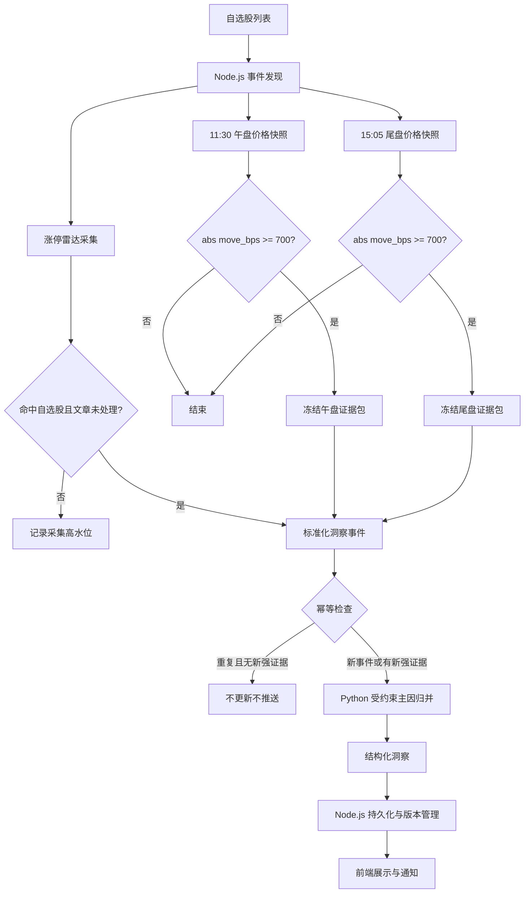

# AiStock 自选股洞察重构 PRD

## 1. 文档信息

| 项目 | 内容 |
|---|---|
| 项目名称 | AiStock 自选股洞察（Watchlist Insight） |
| 文档版本 | V1.0 |
| 状态 | 评审稿 |
| 目标团队 | 产品、Node.js 后端、Python AI、前端、测试 |
| 原功能 | `stock_trace` 个股异动溯源、`alert` 异动捕手 |
| 重构目标 | 用可追溯来源驱动稳定洞察，替代自由因果链推理 |

## 2. 背景、问题与目标

现有 `stock_trace` 在价格异常后，通过大模型构建公司、行业、市场三层候选因素以及主链、备选链。该机制容易在证据不足时推断或补全因果，结果复杂、置信度低且不稳定。

本项目将自动异动能力统一升级为“自选股洞察”：仅针对用户自选股，在确认客观价格事件后，优先使用可追溯的来源文本、公告、行业及市场事实，输出“主导解读因素”而非唯一市场因果。

### 已确定目标

- 仅分析用户自选股。
- 所有主因结论必须可定位到具体来源证据。
- 自动洞察以事件驱动执行，不扫描全部股票并逐只调用模型。
- Python 仅消费 Node.js 标准化数据，不直接获取 A 股行情或网页内容。

## 3. 非目标与废弃能力

### 非目标

- 不证明唯一、严格的市场因果关系。
- 不构建公司、行业、市场三层候选因素。
- 不构建主链、备选链、因果节点或传导路径。
- 不按标题关键词顺序直接判定主因。
- 没有充分证据时，不强行给出公司、行业或市场解释。

### 废弃能力

| 旧能力 | 处理方式 |
|---|---|
| `stock_trace` 三层候选因素 | 废弃 |
| 主链/备选链及因果节点 | 废弃 |
| 因果置信分 | 迁移为“证据充分度”置信等级 |
| 自动触发时调用 `alert` 三子 Agent + Master | 废弃 |
| “确认主因”推送 | 改为“洞察生成/洞察更新” |

用户主动查询的 `alert` 可保留为独立深度问答入口，但不再负责自动洞察。

## 4. 用户角色与用户故事

| 角色 | 用户故事 |
|---|---|
| 自选股用户 | 当我的自选股触及涨停时，我希望看到来源明确的主导解读因素。 |
| 自选股用户 | 当我的自选股午盘或收盘相对开盘大幅波动时，我希望知道是否有可验证的公司、行业或市场信息。 |
| 自选股用户 | 证据不足时，我希望系统明确提示“主因待验证”，而不是生成猜测。 |
| 产品运营 | 我希望查看原始关键词、来源、更新时间和版本，以审查内容质量。 |
| 研发与测试 | 我需要可幂等、可回放、可审计的事件和洞察数据。 |

## 5. 功能范围与事件触发规则

### 5.1 事件类型

| 事件类型 | 事件编码 | 触发时点 | 来源 |
|---|---|---|---|
| 盘中触及涨停 | `limit_up_radar` | 交易时段持续采集 | 同花顺异动股揭秘·涨停雷达文章 |
| 午盘价格异动 | `midday_price_move` | 11:30 后 | 行情快照 + 证据包 |
| 尾盘价格异动 | `close_price_move` | 15:05 后 | 行情快照 + 证据包 |

### 5.2 价格异动判定

```text
move_bps = round((当前价格 - 开盘价) / 开盘价 × 10,000)
abs(move_bps) >= 700
```

| 条件 | direction |
|---|---|
| `move_bps >= 700` | `up` |
| `move_bps <= -700` | `down` |
| 其他 | 不触发 |

### 5.3 幂等与更新规则

业务唯一键：

```text
user_id + symbol + trade_date + direction + insight_group
```

| 场景 | 行为 |
|---|---|
| 同一涨停文章重复采集 | 忽略，不重复创建 |
| 午盘首次达到阈值 | 创建价格异动洞察 |
| 尾盘同方向仍达到阈值 | 更新午盘洞察 |
| 尾盘方向与午盘相反且均达阈值 | 创建独立洞察 |
| 补抓到新增强证据 | 更新既有洞察并记录版本 |
| 来源轻微修改、未增强证据 | 更新来源记录，不推送用户 |

## 6. 端到端流程



## 7. 涨停雷达洞察

### 已确定需求

从同花顺原创·异动股揭秘栏目 `https://yuanchuang.10jqka.com.cn/mrnxgg_list/` 采集涨停雷达文章，并在文章详情页"文章提及标的"中筛选命中自选股的内容。（候选来源 `https://yuanchuang.10jqka.com.cn/zhangting/` 实测存在 `?page=N` 分页 CDN 缓存不一致且每页仅 10 条，已弃用）

| 字段 | 说明 |
|---|---|
| `source_id` | 优先文章 ID；无文章 ID 时使用 URL |
| `source_url` | 详情页链接 |
| `symbol` / `stock_name` | 股票代码与名称 |
| `title` | 原始标题 |
| `keywords` | 从标题解析的候选关键词 |
| `content` | 异动原因揭秘正文 |
| `published_at` / `fetched_at` | 来源发布时间与抓取时间 |
| `content_hash` / `parser_version` | 内容版本与解析版本 |

### 建议方案

- 分页：栏目为静态分页 `index_N.shtml`（每页 20-25 条），采用 HTTP+cheerio 顺序翻页；停止条件为连续 2 页无新文章 ID 或达到 30 页安全上限。
- 冷启动回溯：上线首日回溯最近 2 个交易日（含当日），此后交易时段每 10-15 分钟增量轮询，持续保存采集高水位。
- 自选股命中：栏目列表不含个股字段，需抓取文章详情页。**事件归属锚定标题主体股票**：从标题提取"XX触及涨停/触及跌停"中的主体股票名，与详情页"文章提及标的"（含 symbol/name）中同名项匹配，且该 symbol 命中自选股时创建事件。详情页其他提及标的（推荐/相关板块链接）不建事件——实测详情页含大量推荐股票链接，若按"任意提及标的中第一个命中自选股"匹配，会把事件错误挂到非涨停股（如"涨停雷达：…汇金通触及涨停"被挂到中国电建事件），数据错配。仅标题主体股票命中自选股才建事件；"涨停复盘"类标题（无主体股票）不建事件。
- 以文章 ID 或详情 URL 去重；正文哈希变化时记录新来源版本。
- 仅命中用户自选股时创建洞察事件。
- 当前仅确认该栏目覆盖涨停，跌停覆盖不可假定；以标题"涨停雷达"前缀过滤并监控栏目构成变化。

标题关键词仅为候选项。例如：

```text
涨停雷达：半导体靶材+央企+超跌反弹 东方钽业触及涨停
```

应解析为候选关键词，而非按“半导体靶材”直接认定主因。

## 8. 午盘/尾盘价格异动

### 已确定需求

| 事件 | 行情价格 | 对比基准 | 判定 |
|---|---|---|---|
| 午盘价格异动 | 午盘最后价 | 当日开盘价 | `abs(move_bps) >= 700` |
| 尾盘价格异动 | 收盘价 | 当日开盘价 | `abs(move_bps) >= 700` |

### 数据口径（已确认）

| 项 | 口径 |
|---|---|
| 午盘最后价 | 11:30 定时任务打点腾讯实时行情"最新价"（午间休市前最后一笔连续竞价成交价） |
| 尾盘收盘价 | 15:05 定时任务打点腾讯实时行情"最新价"（14:57-15:00 收盘集合竞价价，无成交则为最后一笔连续竞价价） |
| 对比基准 | 当日开盘价 = 腾讯实时行情"今开"（9:25 集合竞价价） |
| 主口径 | 腾讯实时打点快照，记录 `price_source = realtime_snapshot` |
| 补偿 | 打点缺失/失败时用腾讯 K 线回溯：午盘取 11:25-11:30 分钟 bar 收盘价，尾盘取当日日线收盘价，`price_source = kline_backfill` |
| 校准 | 次日用 Tushare `daily` 回查差异，仅用于质量指标与告警，不回溯改写已发布洞察 |
| 边界 | 无今开（停牌/新股）不触发；价格精度 2 位小数；判定公式与 5.2 节一致 |

说明：尾盘触发时点由原"15:01 后"统一为 15:05，与现有六时段定时任务（9:30/10:30/11:30/13:30/14:30/15:05）对齐。

### 建议方案：冻结证据包

午盘、尾盘 7% 异动没有已经确认的逐股实时解读等价来源。触发时由 Node.js 冻结证据包，Python 只能在该证据范围内归并。

| 事件 | 主要窗口 | 补充窗口 |
|---|---|---|
| 午盘 | 09:25 至 11:30 | 无 |
| 尾盘 | 13:00 至 15:05 | 当日盘前至 09:25 的公告与新闻 |

证据包可包含公司公告/业绩预告、公司新闻、行业题材行情、同行同步异动、市场指数与市场广度，以及价格事实。

触发后 15 至 20 分钟允许补抓资讯；仅新增强证据时才更新洞察结论。

## 9. 主因排序、置信度与待验证

### 主因分类

| category | 含义 |
|---|---|
| `industry_theme` | 行业、题材、产业链、政策或产业事件 |
| `company_event` | 公司公告、订单、重组、产品等 |
| `earnings` | 业绩预告、财报、盈利变化 |
| `market` | 指数、市场广度、海外市场或系统性冲击 |
| `trading_sentiment` | 超跌反弹、技术面、短线资金、情绪博弈 |
| `unconfirmed` | 价格异动已确认，但无可验证主因 |

### 排序规则

1. 正文明确为行业原因，且有具体事实、新闻或行情依据；
2. 正文明确引用公司公告、业绩预告、订单、重组等事实；
3. 证据窗口内存在强公司事实；
4. 行业或题材显著同向，且多只同行同步异常；
5. 市场整体出现显著同向冲击；
6. 仅标题关键词但正文未提供直接支持；
7. 技术面、超跌反弹、短线资金等交易情绪因素。

### 归因流程（已确认）：候选集约束的 LLM 选择 + 规则校验兜底

主因决策分三阶段，LLM 只在"候选集内"做选择，杜绝自由推理与新增事实：

1. **候选抽取（确定性规则）**：从正文按结构信号抽取候选因素（行业原因/公司原因/据公告/据业绩预告/据研报/隔夜美股等），标题关键词经词典映射为分类候选（复用 `sector_aliases.json`），量化联动（见下文阈值）作为独立候选；负向信号（澄清/否认/尚未/不涉及/风险提示，如"公司自查不存在应披露而未披露事项"）将候选标记为 `suppressed`。
2. **LLM 受约束选择与概括**：LLM 从候选集中选择 `primary_driver` 与 `secondary_drivers`（并列主因最多 2 个）并赋置信度。主因 `label` 为主题概括关键词——可沿用候选集中的爬取关键词（标题关键词），也可由 LLM 基于正文证据概括生成（如正文"PCB高端产品供不应求，头部厂商订单排至2027年"→ 概括为"PCB涨价"）。硬约束：label 必须与所选证据直接相关且简短（建议 ≤12 字）；每条选择必须附原文 `evidence_quote`（须在原文可检索）；`category` 必须是 6 类之一；`suppressed` 候选不得选为主因；无可选证据时必须输出 `unconfirmed`，禁止凭空概括。使用 `with_structured_output` + `json_mode` 结构化输出，复用现有解析与修复工具。
3. **规则校验与兜底（确定性）**：校验 LLM 输出——主因 `label` 非空且 ≤12 字、`evidence_quote` 必须在原文中可检索、`category` 合法、未被负向信号抑制。校验不过或 LLM 调用失败时，自动回退到"排序规则 1-7 打分"的规则结果（规则结果 `label` 取候选集标签），丢弃 LLM 输出。

| 证据分层 | 来源 | 置信度 |
|---|---|---|
| L1 正文直接证据 | 正文明确原因引用（行业/公司/公告/业绩） | 高/中 |
| L2 量化联动 | 行业板块/同行/市场冲击（见下文阈值） | 中 |
| L3 标题关键词 | 词典分类的标题标签，正文弱支持 | 低 |

| 置信度 | 判定 |
|---|---|
| 高 | L1 直接来源证据，且无明显冲突 |
| 中 | L2 量化联动支持或 L1 间接证据 |
| 低 | 仅 L3 标题标签、弱新闻或情绪描述 |
| 待验证 | 证据包为空或来源时间无法确认 |

`unconfirmed` 仅限以下三种情况（已收窄，保障归因率）：证据包为空、来源时间无法确认、存在明确冲突且无法裁决。"来源正文不支持标签"不再直接判定 unconfirmed——正文弱支持时按 L3 标题关键词输出低置信度主因；"因素强度接近"不放弃归因，改为并列主因（最多 2 个）分别标注置信度。

标准文案：

> 价格异动已确认，但在当前证据窗口内未找到可验证的主导因素；建议关注后续公告、行业联动及资金变化。

### 行业联动与市场冲击阈值（已确认）

数据源：Tushare 同花顺板块（`ths_member` 成分股 / `ths_daily` 板块日线）、Tushare `daily`（个股日线）、腾讯 6 大指数与市场广度（`TencentSnapshotService` / `MarketSnapshotService`）、Tushare `limit_list_ths`（涨跌停池计数）。

| 判定 | 阈值 | 说明 |
|---|---|---|
| 板块强度 | 目标股所属同花顺行业板块当日 `pct_change >= 3%`（`ths_daily`） | 板块显著走强/走弱 |
| 同行同步 | 同板块成分股中当日同向且涨跌幅 `>= 5%` 的股票数量 `>= 3` 只 | 多只同行同步异常 |
| 市场冲击（任一满足且与个股方向同向） | ① 上证指数当日 `abs(pct_change) >= 1.5%`；② 上涨家数占比 `<= 30%` 或 `>= 70%`；③ 涨停家数 `>= 50` 或跌停家数 `>= 20` | ①与现有晨报市场事件推送阈值（±1.5%）对齐 |

应用规则：
- 同时满足"板块强度 + 同行同步" → 行业联动证据成立，支撑 `industry_theme`（中/高置信度）；仅满足其一 → 证据弱，降为低置信度或由正文证据决定。
- 满足任一市场冲击指标且与个股方向同向 → 市场冲击证据成立，支撑 `market`。
- 行业联动方向与市场冲击方向相反（个股/板块逆势）→ 不合并为主因，按本节排序规则逐级判断。
- 阈值统一放入配置项（如 `insight_thresholds`），一期固定默认值，后续可按市场状态调优。

## 10. 展示与接口契约

洞察卡片必须展示股票名称代码、事件类型、方向、触发时间、相对开盘涨跌幅（价格异动）、主导解读因素、分类、置信度、次因、证据摘要、原始关键词、来源与更新时间。其中主导解读因素 `label` 为主题概括关键词（沿用爬取关键词或由证据概括，如"PCB涨价"），与原始标题关键词并列展示以便对照。

```json
{
  "schema_version": "watchlist-insight.v1",
  "insight_id": "wi_20260804_000962_limit_up",
  "symbol": "000962",
  "stock_name": "东方钽业",
  "trade_date": "2026-08-04",
  "event_type": "limit_up_radar",
  "direction": "up",
  "primary_driver": {
    "label": "半导体产业链",
    "category": "industry_theme",
    "confidence": "high",
    "evidence_excerpt": "行业原因：……",
    "source_ids": ["ths_article_678649592"]
  },
  "secondary_drivers": [
    {"label": "央企", "category": "company_event"},
    {"label": "超跌反弹", "category": "trading_sentiment"}
  ],
  "raw_source": {
    "keywords": ["半导体靶材", "央企", "超跌反弹"],
    "url": "https://yuanchuang.10jqka.com.cn/...",
    "published_at": "2026-08-04T11:01:00+08:00"
  }
}
```

若持久化报告内容，遵循双层输出规范：`display_report` 用于前端展示，`podcast_brief` 用于播报摘要。

### 通知策略（已确认）

现有推送设施：微信模板消息（`WechatPushService`）、飞书卡片（`MessagePushService`）、WebSocket 实时频道（`alert-channel` 的 `pushAlertToUser` / `pushMovementUpdateToUser`），前端推送设置区已有开关（`ProfileView`）。

| 通知类型 | 触发场景 | 策略 |
|---|---|---|
| 首次生成 | 新洞察创建（涨停命中 / 午盘、尾盘触发） | 推送：微信模板 + 飞书卡片 + WS 实时；标题体现主导因素或"主因待验证" |
| 洞察更新 | 补抓证据导致结论实质变化（待验证→有主因、主因标签变化、置信度升级） | 推送"洞察更新"；结论不变（来源轻微修改、补抓无新证据）不推送 |
| 待验证 | 价格异动已确认但主因待验证 | 推送，使用标准"主因待验证"文案，与洞察卡片一致 |

用户偏好（前端推送设置区扩展，复用自选股异动推送基础设施）：
- 新增"自选股洞察推送"开关，默认开启；
- 粒度：全部推送（默认）/ 仅推含主因洞察（待验证静默）/ 关闭；
- 更新类通知固定为"结论实质变化才推"，不开放用户配置。

## 11. 职责边界

| 模块 | 职责 |
|---|---|
| Node.js | 自选股识别、行情获取、网页采集、事件发现、幂等控制、证据包冻结、持久化、推送 |
| Python AI | 候选抽取与校验（规则）、候选集内受约束主因选择与主题概括（LLM）、规则校验兜底、同义标签归一、双层展示内容生成 |
| 前端 | 洞察列表、详情、来源跳转、版本更新提示、待验证状态展示 |
| 测试 | 触发、幂等、排序、降级、来源追溯、更新与推送验证 |

Python 模型只能在候选集内选择来源已支持的候选因素；主因 `label` 可沿用候选关键词，也可基于证据概括为主题关键词。禁止凭空概括、覆盖 `unconfirmed` 结果或生成因果链。LLM 的选择必须通过规则校验（`label` 与 `evidence_quote` 均须锚定原文），校验不过时回退规则结果。

## 12. 异常降级

| 场景 | 系统行为 |
|---|---|
| 涨停雷达抓取失败 | 不创建雷达洞察，记录失败并按采集策略重试 |
| 来源缺少代码或正文 | 保存来源，不生成主因结论 |
| 行情快照缺失 | 不触发午盘/尾盘价格洞察 |
| 证据包为空 | 发布“价格异动已确认，主因待验证” |
| LLM 主因选择失败或校验不过 | 自动回退"排序规则 1-7 打分"结果，不生成无来源结论 |
| LLM 展示文案生成失败 | 规则模板文案兜底，洞察与归因结果不受影响 |
| 规则与 LLM 冲突 | 以规则结果为准 |
| 推送失败 | 洞察仍持久化，进入推送重试队列 |

## 13. 埋点与指标

| 指标 | 说明 |
|---|---|
| `watchlist_insight_source_collected_total` | 来源采集量 |
| `watchlist_insight_event_detected_total` | 自选股事件发现量 |
| `watchlist_insight_created_total` | 新洞察生成量 |
| `watchlist_insight_updated_total` | 洞察更新量 |
| `watchlist_insight_unconfirmed_total` | 主因待验证数量 |
| `watchlist_insight_source_parse_failed_total` | 来源解析失败量 |
| `watchlist_insight_llm_degraded_total` | 模型降级量 |
| `watchlist_insight_deduplicated_total` | 幂等去重数量 |
| `watchlist_insight_delivery_success_total` | 成功推送数量 |

质量指标包括来源可追溯率、主因证据覆盖率、重复洞察率、待验证率、人工一致率、采集时效和更新有效率。

## 14. 测试矩阵

| 类别 | 场景 | 预期 |
|---|---|---|
| 涨停采集 | 新文章命中自选股 | 创建一条雷达洞察 |
| 涨停采集 | 同一文章重复抓取 | 不重复创建 |
| 涨停归因 | 正文有明确行业原因 | 行业/题材可成为主因 |
| 涨停归因 | 正文有公司订单公告 | 公司事件可成为主因 |
| 午盘触发 | 699 bps | 不触发 |
| 午盘触发 | 700 bps 或 -700 bps | 触发且方向正确 |
| 尾盘更新 | 午盘已触发、尾盘同方向仍异常 | 更新既有洞察 |
| 证据归因 | 无强证据 | 返回 `unconfirmed` |
| 模型降级 | LLM 不可用 | 规则结果或待验证仍可展示 |
| 推送 | 无新增强证据的来源更新 | 不重复推送 |

## 15. 分期计划

### 一期：涨停雷达自选股洞察

- 涨停雷达采集、去重和版本管理；
- 自选股筛选；
- 标题关键词与正文解析；
- 主因、次因、置信度、来源证据输出；
- 前端列表与详情；
- 停止新写入旧 `stock_trace` 因果链结果；
- 切换时删除旧 `stock_trace` 历史数据（保留表结构，破坏性操作，执行前先备份）。

不包含跌停雷达及午盘/尾盘 7% 自动归因。

### 二期：午盘/尾盘价格异动洞察

- 午盘、尾盘快照与基点阈值触发；
- 冻结证据包；
- 公司、行业、市场、交易情绪分类；
- 15 至 20 分钟补充证据更新；
- 主因待验证展示与通知策略。

## 16. 风险、依赖与待确认事项

### 风险

| 风险 | 应对 |
|---|---|
| 涨停雷达网页结构变化 | 解析版本、监控、降级和告警 |
| 来源发布时间晚于触板时间 | 分别记录事件时间和来源时间 |
| 标题标签噪声 | 正文证据优先，不按标题顺序判断 |
| 午盘/尾盘缺少逐股解读源 | 仅在强证据存在时给出主因 |
| 同一股票多次触板 | 文章 ID、事件键与版本管理 |
| 模型幻觉 | 规则优先，禁止新增事实 |

### 待确认事项

- 同花顺异动股揭秘栏目采集的授权与使用范围 — 已确认：直接爬取；采集侧控制频率（`thsCrawler` 3 并发 + 限流 + 指数退避重试），失败降级不中断主流程；
- 是否存在稳定的跌停雷达或等价来源 — 已确认：未找到稳定"跌停雷达"文章来源（同花顺原创及 `mrnxgg_list` 栏目当前均仅涨停雷达文章）。一期不覆盖跌停异动；二期候选：Tushare `limit_list_ths` 跌停池（结构化数据，含首封/尾封时间、开板次数等，需 8000 积分），复用午盘/尾盘归因机制，无解读文章时输出待验证；
- 涨停雷达历史回溯深度及分页加载方式 — 已确认：冷启动回溯 2 个交易日；静态分页 `index_N.shtml` 用 HTTP+cheerio 顺序翻页；停采条件为连续 2 页无新文章 ID 或 30 页上限；
- 午盘最后价、尾盘收盘价的数据口径 — 已确认：腾讯实时打点为主（11:30 午盘最后价 / 15:05 收盘价，复用六时段定时任务）、腾讯 K 线补偿、Tushare 次日校准，记录 `price_source`；
- 行业联动、同行数量和市场冲击阈值 — 已确认：板块强度 ≥3%、同行同步 ≥3 只且同向 ≥5%、市场冲击（上证 ±1.5% / 广度 ≤30% 或 ≥70% / 涨跌停家数 ≥50 或 ≥20），详见第 9 节；
- 首次生成、更新、待验证三类通知的用户偏好 — 已确认：首次生成与待验证推送（可配置静默）、更新仅结论实质变化时推送，详见第 10 节；
- 旧 `stock_trace` 历史数据是否迁移、保留只读或删除 — 已确认：直接删除；切换时清理 `stock_trace` 相关表（011-015 迁移：events/event_revisions/signals/user_events/push_records、snapshots/source_records、results/candidates/chains/chain_nodes、artifacts、jobs/outbox）数据并保留表结构，破坏性操作先备份。

## 17. 验收标准

### 一期

- [ ] 新涨停雷达文章可在目标时效内采集并解析。
- [ ] 命中自选股的文章可生成一条可展示洞察。
- [ ] 非待验证主因均包含关键词、证据片段、来源 URL 和来源时间。
- [ ] 同一文章重复采集不会重复创建洞察。
- [ ] 正文明确行业原因时，系统不会仅因标题顺序选择其他关键词为主因。
- [ ] 无正文直接支持时，系统输出低置信度或主因待验证。
- [ ] 自动洞察不再调用旧三层候选因素、因果链或 `alert` 三子 Agent。

### 二期

- [ ] 午盘、尾盘按 `abs(move_bps) >= 700` 准确触发。
- [ ] 699 bps 不触发，700 bps 触发。
- [ ] 午盘与尾盘同方向事件按规则更新同一洞察。
- [ ] 有公司公告、行业联动或市场冲击时，主因分类与证据一致。
- [ ] 无充分证据时，系统稳定输出“价格异动已确认，主因待验证”。
- [ ] 触发后补充资讯仅在出现新增强证据时更新结论。
- [ ] 模型不可用不会造成事件丢失或生成无来源结论。
